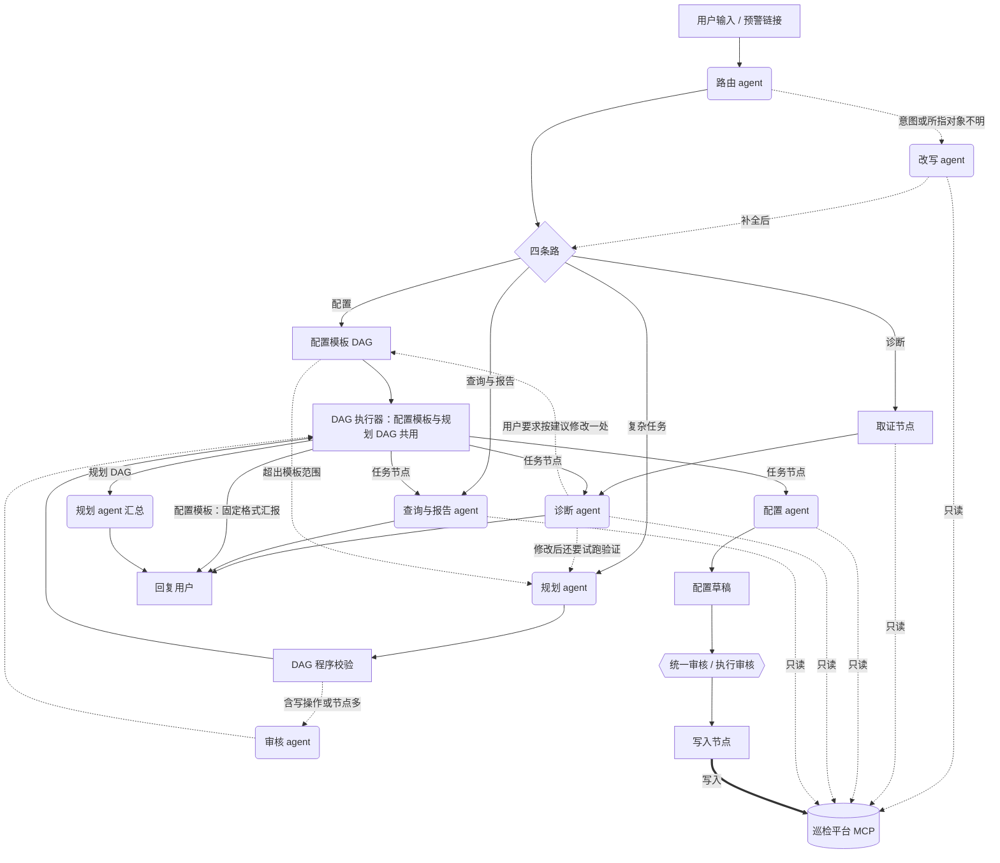
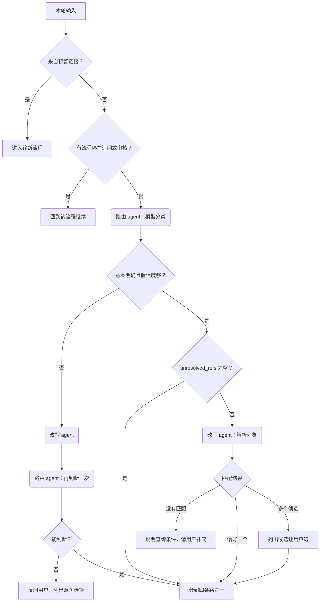
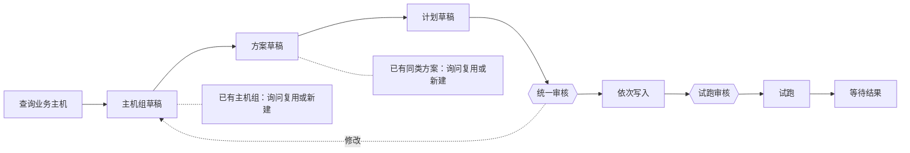
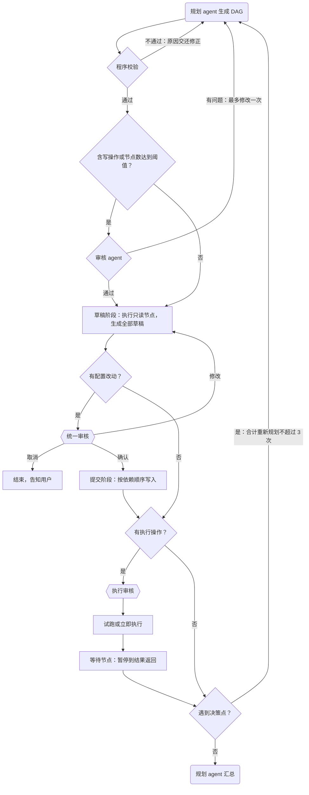
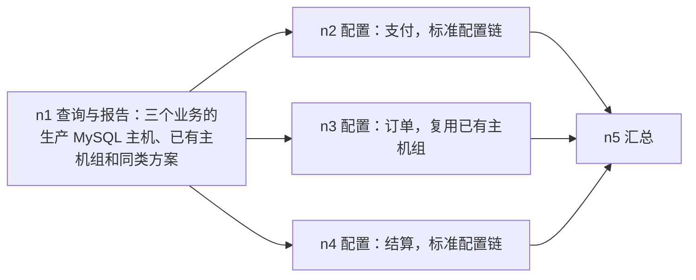
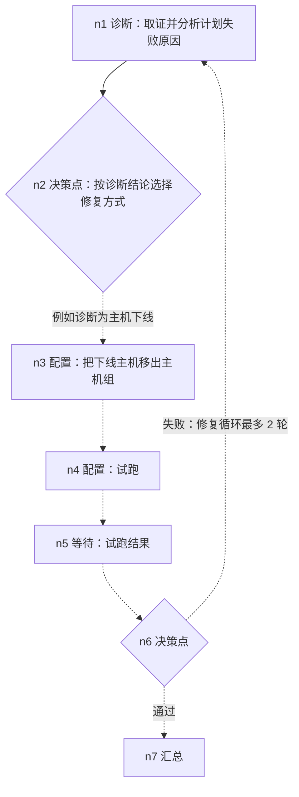
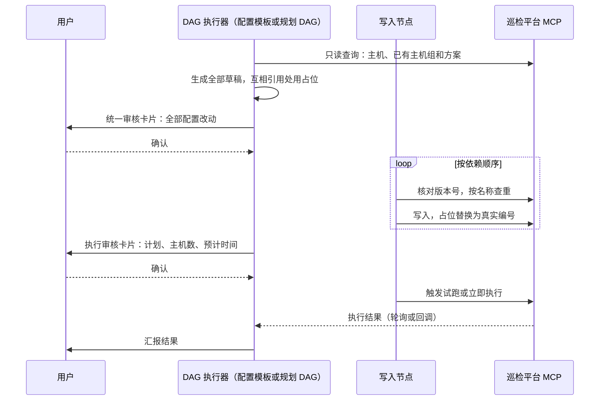
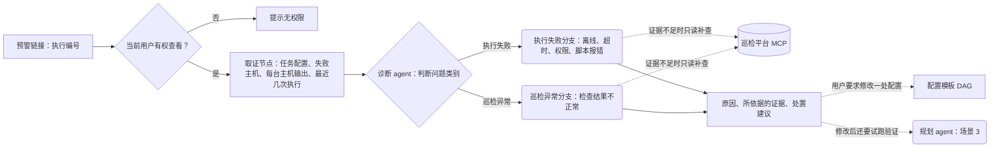

# 方案：巡检平台的智能化多 agent

状态：讨论中，未审批。本文先沉淀已达成一致的背景、范围和 agent 分工；标为「待确认」的条目需要进一步讨论。

## 背景

现有一个巡检平台：

- 业务方在平台上配置巡检方案和巡检计划。巡检对象只能按主机选择，计划可以定期执行。
- 巡检执行出问题时，平台向管理员推送预警消息。

平台能力通过外部 MCP 服务提供给本系统。本系统不直接读平台数据库，也不绕过 MCP 调平台接口。

对话层的基建已经就绪：鉴权、会话、Trace 和 Span 持久化、SSE 推送、对话分支与历史接口、按 agent 的上下文策略、按需取历史工具。下一步把现在的模拟回复换成真正的多 agent。

## 需求要解决的问题

1. **用对话配置巡检**：业务方不必熟悉平台表单，用自然语言说明「检查什么、查哪些主机、多久执行一次、通知谁」，由 agent 生成巡检方案和巡检计划。修改已有配置也走对话，例如调整周期、增减主机、暂停计划。
2. **巡检出问题后由 agent 分析**：用户从预警消息直接进入对话，agent 取回这次执行的证据，判断原因并给出处置建议。问题分两类，两类都要处理：
   - 任务执行失败：主机 agent 离线、超时、权限不足、脚本报错等。
   - 巡检发现异常：任务执行成功，但检查结果不正常，例如磁盘将满。
3. **查询与报告**：用自然语言查询巡检结果，例如「上周哪些主机失败最多」；生成日报、周报；回答平台使用问题。
4. **复杂请求**：要做哪些步骤、按什么顺序做，取决于请求内容和平台现状，无法事先写成一条固定流程。例如多个业务批量配置、按现状补齐巡检覆盖、诊断之后修复并验证、上线前批量核查。这类请求由规划 agent 先规划再执行，场景见「规划 agent 的适用场景」。

## 范围
| 类别 | 内容 |
| --- | --- |
| 第一版实现 | 对话配置（新建、修改）、问题诊断（两类）、查询与报告、复杂请求的规划与执行 |
| 第一版设计、稍后实现 | 由平台事件触发的执行（预警聚合降噪、推送预警时附带初步诊断）；用户对诊断结论的反馈结构 |
| 暂不做 | 自动执行修复（重跑、重启、清理）；生成巡检脚本；关联变更系统 |

「稍后实现」的两项会影响 Trace 模型和入口设计，本方案先把边界留好：Trace 不能假定每一轮都有用户输入；诊断结论要能挂上用户反馈。

## Agent 分工

共 7 个 agent，另有几个不调用模型的流程节点。路由把请求分到四条路：配置、诊断、查询与报告、复杂任务。

| Agent | 负责 | 内部结构 | MCP 权限 | 不做 |
| --- | --- | --- | --- | --- |
| 路由 | 识别意图，把请求分到四条路之一 | 单次调用，结构化输出 | 无 | 不回答问题，不改写用户输入 |
| 改写 | 把不准确的用户输入改写成可执行的请求：补全指代，把「昨天创建的计划」这类描述对应到平台上的具体对象，把相对时间换算成具体范围 | 带只读工具，最多 3 次调用 | 只读 | 不凭推测补充信息，多个候选时不替用户选 |
| 规划 | 把复杂任务拆成 DAG，在决策点规划后续节点，最后汇总各节点结果 | 结构化输出 | 无 | 不调用其他 agent，不直接执行 |
| 审核 | 检查 DAG 的语义问题：遗漏、顺序、多出的写操作、描述不清 | 单次调用，结构化输出 | 无 | 不改 DAG，不查平台数据 |
| 配置 | 在配置模板 DAG 的节点里生成草稿：选主机，写主机组、巡检方案、巡检计划的内容；修改请求时产出改动清单 | 固定模板，模型只在节点内部工作 | 只读 | 不决定流程步骤，不写入平台，不触发执行 |
| 诊断 | 分析执行失败和巡检异常，给出原因、依据和结构化的处置建议 | 固定取证 + 边想边查 | 只读 | 不执行修复动作 |
| 查询与报告 | 查询巡检结果和平台现状，生成日报周报，回答平台使用问题 | 边想边查，有调用上限 | 只读 | 不起草配置，不写平台 |

流程节点（固定代码，不调用模型）：

| 节点 | 作用 |
| --- | --- |
| 配置模板 | 标准配置链固化成的 DAG，节点和顺序写死，带条件跳过 |
| DAG 校验 | 对规划 agent 生成的 DAG 做程序校验 |
| DAG 执行器 | 执行配置模板和规划 DAG：调度、并行、暂停与恢复、只传上游输出 |
| 取证 | 按执行编号固定取回诊断需要的证据 |
| 人工审核 | 统一审核卡片和执行审核卡片 |
| 写入 | 按审核过的草稿写入平台，是唯一有写权限的节点 |
| 等待 | 等待试跑或执行结果，期间 DAG 暂停 |

总体架构（实线为主流程，虚线为按条件触发；圆角框为 agent，方框为流程节点，六边形为人工审核）：



只有写入节点对平台有写权限；所有 agent 最多只读。

### 各 agent 的职责

**路由 agent**

- 作用：判断这一轮请求走哪条路：配置、诊断、查询与报告、复杂任务。
- 何时调用：「路由」一节里的规则不适用时，每轮调用一次；改写之后可能再调用一次。
- 输入：本轮原文、最近几轮对话、会话里已解析过的对象。
- 输出：`intent`、`confidence`、`slots`、`unresolved_refs`、`wants_write`，见「路由」。
- 不做：不回答问题，不改写输入，不查平台。

**改写 agent**

- 作用：把不准确的输入改成下游可以直接执行的请求：补全对话内指代，把描述性引用对应到平台上的具体对象，换算相对时间，规范化别名。
- 何时调用：意图无法判断、置信度低，或 `unresolved_refs` 不为空。每轮最多一次。
- 输入：原文、最近几轮对话、路由结果、当前用户、当前时间和时区。
- 输出：`rewritten`、`entities`、`time_range`、`unresolved`，见「改写」。
- 不做：不凭推测补充信息；有多个候选时不替用户选。

**规划 agent**

- 作用：把复杂任务拆成 DAG；执行到决策点时，根据已有结果规划后续节点；最后汇总各节点结果回答用户。
- 何时调用：路由判为复杂任务；配置模板执行中发现超出模板范围；诊断之后用户要求修复并验证；DAG 执行到决策点，或节点失败需要调整。
- 输入：改写后的请求和 `entities`、已登记的 agent 能力清单和配置模板；重新规划时另有已完成节点的输出。
- 输出：DAG 数据（节点、类型、依赖、上游引用）；汇总时输出最终回答。
- 不做：不调用其他 agent，不执行节点，不查平台。

**审核 agent**

- 作用：检查规划出的 DAG 在语义上是否可行：是否遗漏用户的要求、顺序和依赖是否合理、是否有用户没要求的写操作、子任务描述下游能否直接执行。
- 何时调用：DAG 通过程序校验，并且含写操作或节点数达到阈值。配置模板不经过审核 agent。
- 输入：用户请求（原文和改写结果）、DAG、程序校验标出的写操作节点。
- 输出：通过，或结构化的问题清单（问题类型、涉及节点、原因）。
- 不做：不修改 DAG，不查平台。

**配置 agent**

- 作用：在配置模板 DAG 的节点里生成草稿内容：从查询结果中选出要纳入巡检的主机，写主机组、巡检方案（检查项、阈值、超时）、巡检计划（周期、通知对象）。修改请求时对比现状，产出改动清单。
- 何时调用：配置模板执行到草稿节点时。规划 DAG 里的配置节点展开成配置模板后，同样由它生成草稿。
- 输入：该节点的子任务、上游节点的输出、`entities`；从诊断转来时另有诊断给出的结构化改动。
- 输出：结构化草稿，草稿之间的引用用占位；信息不够时输出追问。
- 不做：不决定下一步做什么，不写入平台，不触发执行。

**诊断 agent**

- 作用：分析一次执行出的问题，判断属于执行失败还是巡检异常，给出原因、依据和处置建议。
- 何时调用：从预警链接进入；用户在对话里问某次执行为什么失败；规划 DAG 里的诊断节点。
- 输入：取证节点取回的固定证据、用户的补充描述。
- 输出：
  - 问题类别；原因，可以有多个，按可能性排序；每个结论所依据的证据。
  - 处置建议分两类：需要改配置的，写成结构化改动（对象、字段、建议值），可以直接交给配置模板；平台之外的操作，例如恢复主机上的 agent，写成操作步骤。
- 不做：不执行修复，不写平台。用户要求按建议修改时的交接见「诊断」。

**查询与报告 agent**

- 作用：回答巡检结果和平台现状的查询，生成日报周报，回答平台使用问题。
- 何时调用：路由判为查询与报告；规划 DAG 里的查询节点，例如先查出三个业务的主机和已有方案。
- 输入：改写后的请求、`entities`、`time_range`。
- 输出：答案或报告，每个结论注明来源。
- 不做：不起草配置，不写平台。流程不固化，边界见「查询与报告」。

### 路由

先按规则，规则不适用时再交给模型：

1. 从预警链接进入的会话，直接进入诊断，不经过模型分类。
2. 上一轮有流程停在追问或等待确认，这一轮的输入回到那条流程，不重新分类。
3. 其余情况由模型输出结构化结果：

```text
intent            配置 / 诊断 / 查询与报告 / 复杂任务 / 无法判断
confidence        置信度
slots             已识别的信息，例如计划名、主机、时间范围
unresolved_refs   没能确定所指的说法，例如「它」「刚才那个计划」「我昨天创建的巡检计划」「支付那个方案」「昨天」
wants_write       用户是否要求改动平台（新建、修改、删除、试跑）
```

路由与改写的判断顺序：



调度方式是固定流程：图的结构不变，路由只在四条路里选择。「无法判断」不是第五条路，而是先改写，改写后仍判断不了就反问用户。请求是否复杂由路由判断，简单请求不经过规划 agent。

四条路：

| 路 | 去向 | 典型请求 |
| --- | --- | --- |
| 配置 | 配置模板 DAG | 「给支付业务的生产 MySQL 配个每天 8 点的磁盘巡检」「把 P-123 改成每周一执行」 |
| 诊断 | 取证节点 + 诊断 agent | 预警链接；「昨晚那次巡检为什么失败」 |
| 查询与报告 | 查询与报告 agent | 「上周哪些主机失败最多」「出一份本周周报」「方案和计划有什么区别」 |
| 复杂任务 | 规划 agent | 「规划 agent 的适用场景」里的四类请求 |

配置和复杂任务的分界，看请求能不能套进一条标准配置链：

| 判为配置 | 判为复杂任务 |
| --- | --- |
| 单个业务、一条配置链 | 多个业务，或需要多条配置链 |
| 步骤由模板覆盖，包括跳过已有的主机组或方案 | 下一步要看中间结果才能决定，例如先查覆盖缺口再决定补什么 |
| 只涉及配置 | 跨多种能力，例如诊断、修改、验证 |

路由拿不准时优先判为配置。配置模板执行中发现超出模板范围，例如查出的主机分属多个业务、需要分别配置，就把已有结果交给规划 agent，升级为复杂任务。所以路由不必在第一步就把复杂度判断准。

诊断这条路只负责分析和给出建议，不负责执行修复。用户看完诊断要求修改时，按同样的分界转交：只改一处配置的交给配置模板，改完还要试跑验证、失败再诊断的交给规划 agent，见「诊断」。

### 改写

改写解决用户输入不准确的问题，把它变成下游 agent 可以直接执行的请求。例如「帮我执行我昨天创建的巡检计划」：意图明确，但「昨天创建的巡检计划」不在对话里，需要查平台才知道是哪一个。

触发条件，满足任一即可：`intent` 为「无法判断」、置信度低于阈值、`unresolved_refs` 不为空。意图和对象都明确的请求不经过改写。

要处理的不准确类型：

| 类型 | 例子 | 解决方式 |
| --- | --- | --- |
| 对话内指代 | 「它为什么又失败了」「再跑一次」 | 查对话历史 |
| 平台对象的描述性引用 | 「我昨天创建的巡检计划」「支付那个方案」「上次失败的任务」 | 用只读 MCP 工具按条件查询，例如按创建人和创建时间筛选计划 |
| 相对时间 | 「昨天」「上周」「最近」 | 按当前时间和时区换算成具体范围 |
| 别名和口语 | 「支付」「MySQL 那几台库」 | 对照平台的业务、主机组名称规范化 |
| 真正的歧义 | 「帮我弄一下巡检」 | 无法补全，反问用户 |

改写 agent 的输入包括：原文、最近几轮对话、当前用户、当前时间和时区。它可以调用只读 MCP 工具，单次改写的工具调用有上限（暂定 3 次）。

输出：

```text
rewritten    改写后的请求，所指对象写成平台上的具体对象，例如「执行巡检计划 P-123（支付 MySQL 日检，昨天 15:20 创建）」
entities     每个解析出的对象：原说法、对象类型、编号、名称、来源（对话历史或某次 MCP 查询及其条件）
time_range   换算后的时间范围
unresolved   仍无法确定的说法
```

解析结果的处理：

- 恰好一个匹配：写入 `rewritten` 和 `entities`，按下面「约束」中的规则交给对应 agent 或重新路由。
- 多个匹配：不替用户选。列出候选（名称、创建时间、所属业务）让用户点选，选定后继续。请求含写操作时尤其如此。
- 没有匹配：告诉用户没找到，并说明用了什么条件查询，例如「你在 9 月 29 日没有创建过巡检计划」，请用户补充。

约束：

- 改写结果里的每个对象和事实都要有来源：来自对话历史，或来自某次 MCP 查询的结果。模型不能凭推测补充。
- 查询平台对象时按当前用户的身份和权限进行，查不到无权访问的对象。
- 改写最多一次。改写之后是否重新路由，看第一次路由的结果：
  - 第一次已判断出意图，只是对象不明确（`unresolved_refs` 不为空）：改写完成后直接交给该意图对应的 agent，不再路由。
  - 第一次连意图都判断不了，或置信度低：改写后重新路由一次。仍判断不了，就反问用户，并列出意图选项让用户点选。
- 原文、改写结果和 `entities` 都往下传、都记入 Span。改写幅度大时，回复开头写「我理解为：……」。
- 下游 agent 直接使用 `entities` 里的编号，不再各自重新解析同一个说法。
- 涉及写操作时，审核卡片展示解析出的具体对象，例如计划名称、编号、创建时间，作为最后一道核对。

改写与配置 agent 的分工：改写解析的是「用户指的是平台上已有的哪个对象」；配置 agent 标准配置链中的「查询业务主机」是按条件选出这次要纳入巡检的主机，属于配置本身，不由改写处理。

### 标准配置链（配置模板 DAG）

从零为一个业务配置巡检，步骤和顺序是固定的，因此固化成一个模板 DAG：



- 模板的节点和顺序写在代码里，不由模型生成。它和规划 agent 生成的 DAG 共用同一个 DAG 执行器，暂停与恢复、上游输出的传递、审核节点、写入节点都复用。两者的区别只在 DAG 从哪里来：一个来自模板，一个由模型生成。因此模板 DAG 不经过程序校验和审核 agent。
- 配置 agent 只在节点内部生成草稿，不决定下一步做什么。
- 条件跳过由程序判断。每一步开始前先查现状：主机组、同类方案已经存在时，询问用户复用还是新建；选择复用就跳过对应的草稿节点。
- 修改已有配置时，配置 agent 先对比现状产出改动清单，程序按清单只保留涉及的节点。例如只改周期，就只走计划草稿、统一审核和写入。
- 建主机组、写方案、写计划三项草稿全部生成后统一审核一次，再按顺序写入；试跑放在最后单独审核。详见「写操作的安全边界」。
- 执行结束后按固定格式汇报：创建或修改了哪些对象、编号、试跑结果。

这条链也是规划 agent 最常用的子流程：规划时写一个「为某业务配置巡检」的配置节点，执行时展开成这个模板，而不是拆成五个节点。

### 查询与报告

查询与报告不固化流程，由查询与报告 agent 按问题自己决定查什么、查几次。问题形态太多，事先画不完流程；它又是只读的，放开不会改动平台。边界由程序保证：

- 工具集只有只读查询工具和平台使用文档的检索，没有起草工具。用户只想查一下时，结构上就不可能产出配置草稿。
- 单轮工具调用有次数上限（暂定 8 次）；单次返回超过长度限制时截断，并告诉模型结果被截断。
- 每个结论都要对应到某次工具调用的结果，回复里注明来源，例如查询条件和时间范围。查不到就说查不到，不补编。
- 日报、周报使用固定模板：结构和指标的定义固定，模型只填数据和写结论。
- 结果太多时，例如失败主机上千台，给出统计和前若干条，并说明筛选条件。
- 用户在查询之后说「那帮我配上」，这一轮重新路由到配置，配置 agent 通过取历史工具读取上一轮的查询结果，不重新查询。

### 规划 agent 的适用场景

步骤和顺序固定的请求不需要规划。规划 agent 只处理「做哪些步骤、按什么顺序，要看请求内容和平台现状才能决定」的请求：

1. **多个业务批量配置**：「给支付、订单、结算三个业务的生产 MySQL 都配上巡检，每天 8 点执行，先试跑一次」。三个业务各走一次标准配置链，彼此独立、并行执行；已有主机组或同类方案的业务跳过或复用对应步骤。
2. **按现状补齐覆盖**：「确保支付业务所有主机都有磁盘巡检」。先查出未被覆盖的主机，再决定加入已有主机组，还是新建主机组、方案和计划；全部已覆盖时不做任何写操作，直接答复。
3. **诊断之后修复并验证**：「这个计划老是失败，帮我查一下原因并修好」。取证、诊断后，按原因决定改法：主机下线就移出主机组，超时就调大超时，检查项不适用就更换；改完试跑，试跑仍失败就回到诊断，有次数上限。
4. **上线前批量核查**：「下周大促，把核心业务的巡检都跑一遍，出一份报告，失败的给出原因」。查出核心业务的计划，并行试跑，等待结果，逐个诊断失败项，最后汇总成报告。

第 1、3 种最能体现规划的价值，作为第一版的验收场景：第 1 种覆盖并行和按现状跳过或复用步骤，第 3 种覆盖跨 agent、条件分支和重新规划。

### 规划与 DAG

规划 agent 只输出 DAG 数据，调度由 DAG 执行器完成，互不依赖的节点并行执行。每个节点包含：节点编号、节点类型、使用的 agent、子任务描述、依赖的节点、引用上游输出的方式。

节点类型：

| 类型 | 作用 |
| --- | --- |
| 任务 | 交给一个功能 agent 完成子任务 |
| 等待 | 等待外部结果，例如试跑完成；等待期间 DAG 暂停，不占用连接 |
| 决策点 | 规划时无法确定后续步骤，执行到这里时把已有结果交回规划 agent，由它规划接下来的节点 |
| 汇总 | 由规划 agent 汇总各节点结果，生成最终回答 |

一个 DAG 从生成到结束：



重新规划出的节点重新经过程序校验；其中新增的配置改动要再统一审核一次。

场景 1 的规划结果，三个配置节点并行：



n2 到 n4 执行时各自展开成配置模板；n3 在模板中跳过主机组草稿节点。三个业务的草稿全部生成后合并成一张统一审核卡片。

场景 3 的规划结果，虚线部分在执行到决策点时才规划出来：



执行规则：

- 下游节点只拿到上游节点的输出，不拿整段对话历史，沿用各 agent 的上下文策略和 `select_upstream`。
- 节点失败时，它的下游跳过，不相关的节点继续；汇总时说明哪些步骤未完成。
- 重新规划有两种来源：决策点，以及节点失败后按失败原因调整。同一个 DAG 合计重新规划最多 3 次，「修复 → 试跑 → 诊断」的循环最多 2 轮，超过后停止并把现状告诉用户。
- 执行中途追问用户、等待确认或等待试跑结果时，整个 DAG 暂停，进度（已完成的节点和输出）由 checkpointer 保存，条件满足后从该节点继续。

### DAG 的两层检查

第一层是程序校验，每个 DAG 都要经过：

- 结构：无环，依赖的节点存在，节点数不超过上限。
- 能力：节点使用的 agent 已登记，子任务类型在它的能力范围内。
- 参数：输入符合该 agent 的参数格式，引用的上游字段存在。
- 权限：涉及的业务当前用户有权操作。
- 标记所有写操作节点；路由输出的 `wants_write` 为假而 DAG 含写操作节点时，直接判为不通过。
- 重新规划产生的新节点同样要经过这一层校验。

校验失败的原因原样交还规划 agent 修正。

第二层是审核 agent，只在 DAG 含写操作、或节点数达到阈值时触发。它检查：是否遗漏用户的要求、顺序和依赖是否合理、是否出现用户没要求的写操作、子任务描述下游能否直接执行。输出结构化的问题清单（问题类型、涉及节点、原因）。审核不给 MCP 工具；「主机是否存在」这类问题交给执行阶段处理。审核不通过时规划 agent 修改一次，仍不通过就把问题告诉用户。

待确认：审核触发的节点数阈值（暂定 4）；审核 agent 是否使用与规划 agent 不同的模型。

### 写操作的安全边界

写操作分两类，审核方式不同：

| 类别 | 内容 | 审核 |
| --- | --- | --- |
| 配置改动 | 新建、修改、删除主机组、巡检方案、巡检计划 | 一组改动统一审核一次 |
| 执行操作 | 试跑、立即执行计划 | 放在最后，单独审核 |

执行操作会在生产主机上跑检查，影响和配置改动不同，所以不并入统一审核。

模型只生成草稿，写入平台由固定的写入节点完成，它只接受用户审核过的草稿，原样提交。一次请求分四个阶段：

1. **草稿阶段**：执行只读步骤，各配置节点生成全部草稿，不写入平台。草稿之间的引用用占位表示，例如方案引用「本次将创建的主机组 n2」，提交时替换成真实编号。
2. **统一审核**：一张卡片列出这次全部配置改动，每项写明具体内容：主机数量和清单、检查项、周期换算成的具体时间、通知对象；修改已有配置时展示前后差异；由改写解析出的对象写明名称、编号和创建时间。操作为确认、修改、取消。选择修改时回到草稿阶段重新生成对应草稿，再次统一审核。
3. **提交阶段**：按依赖顺序写入，不再逐项确认。
4. **执行审核**：试跑或立即执行前单独审核一次，列出计划、主机数量和预计执行时间。



适用范围：

- 复杂请求：规划 agent 的 DAG 按上面四个阶段执行。审核卡片按业务分组展示，例如「支付：主机组、方案、计划；订单：复用主机组，方案、计划」。
- 单个业务的配置请求：配置模板 DAG 同样按四个阶段执行，建主机组、写方案、写计划只审核一次，试跑单独审核。
- 决策点之后新规划出的配置改动，是统一审核时没有见过的内容，执行前要对这一组新增改动再统一审核一次。

提交阶段的保护：

- 写入前核对对象的版本号或更新时间。审核之后对象被别人改过的，停止提交，展示变化，请用户重新审核。
- 创建前先按名称查一次，已存在则不重复创建，重试不会产生重复对象。
- 中途失败时停止后续写入，告诉用户哪些已经创建、哪些失败，并提供两个选项：重试失败的步骤，或删除本次已创建的对象。删除是配置改动，同样经过审核。

### 诊断

入口是预警消息里的链接，点开后新建会话，第一轮带上这次执行的上下文。后端先确认当前用户有权查看该任务。

诊断分两步：

1. 取证（流程节点）：按执行编号通过 MCP 固定取回任务配置、失败主机、每台主机的输出或错误、最近几次执行结果。
2. 诊断 agent：先判断属于「执行失败」还是「巡检异常」，两类使用不同的提示词分支；结合历史和多台主机的分布缩小原因范围；证据不足时可以调用只读工具补查。每个结论标注依据的证据。



诊断之后的交接：

- 处置建议里需要改配置的部分写成结构化改动（对象、字段、建议值）。用户选择「按建议修改」时，只改一处配置的，把结构化改动交给配置模板，配置 agent 据此生成草稿，照常统一审核。
- 用户要求改完再试跑、失败了再查的，交给规划 agent，按场景 3 规划；已有的取证和诊断结果作为第一个节点的输出，不重新取证。
- 平台之外的操作，例如恢复主机上的 agent、扩容磁盘，只给出操作步骤，本系统不执行。

待确认：链接携带哪些参数、是否签名防伪、由平台还是本系统生成。

### 执行过程的记录

- 每个 agent 一个 `agent` Span，模型调用为 `llm` Span，MCP 调用为 `mcp_call` Span，追问和确认为 `human_input` Span。
- 路由结果、改写前后的文本和解析出的对象、DAG 本身和审核结论写入对应 Span，`visible` 为假，供审计。
- DAG 节点的 agent Span 以规划 agent 的 Span 为父节点。
- llm Span 写入 `prompt_version`、`context_rule_version`、`input_digest`。

## 候选方案：功能 agent 的内部结构

上面的分工在各方案中相同，区别在配置、诊断、查询与报告三个功能 agent 内部怎么组织。

### 方案 A：细分步骤

每个功能 agent 是一段固定子流程，每一步一个专职的小 agent 或流程节点。例如配置 agent 按标准配置链拆成：需求澄清 → 查询业务主机 → 主机组草稿 → 方案草稿 → 计划草稿 → 统一审核 → 依次写入 → 试跑审核 → 试跑。

### 方案 B：自带工具，边想边调用

每个功能 agent 是一个带工具的 agent（ReAct），自己决定何时调用哪个 MCP 工具、何时结束。写入工具不交给它，仍由确认和写入节点完成。

### 方案 C：按 agent 的性质分别选择

- 配置用方案 A：标准配置链固化成配置模板 DAG，节点和顺序写死，配置 agent 只在节点内部生成草稿。步骤固定、涉及写入，需要每一步可控、可测。
- 诊断的取证固定（流程节点），分析用方案 B：证据补查的路径不固定。
- 查询与报告用方案 B：问题形态多样，按需组合只读工具；边界由程序保证，见「查询与报告」。

也就是说，涉及写入的部分固化流程，只读的部分放开给模型。

### 对比

| 维度 | A 细分步骤 | B 自带工具 | C 按性质选择 |
| --- | --- | --- | --- |
| 可控性 | 高，每步输入输出固定 | 低，调用路径由模型决定 | 写入相关的部分高 |
| 测试 | 每步可单测 | 只能端到端测，结果不稳定 | 配置可单测，诊断和查询端到端测 |
| 模型调用次数 | 多，每步至少一次 | 视问题而定，简单问题少 | 居中 |
| 应对没预料到的问题 | 差，要改流程 | 好 | 诊断和查询好 |
| 新增一种能力 | 要加步骤和边 | 加工具即可 | 视所在 agent 而定 |

### 推荐

采用方案 C（讨论中已确认）。配置涉及写入，可控性优先；诊断和查询的路径事先无法穷举，灵活性优先。诊断的取证固定下来，保证每次分析都有同一组基础证据，便于比较和评测。

不采用方案 A：诊断和查询要为每种可能的补查预先画好流程，场景一多就改不动。不采用方案 B：配置流程的澄清、主机解析和草稿生成都会变得不可预测，出错时难以定位是哪一步。

## 评测

7 个 agent 串联时，最终结果不对很难判断是哪一环出错，所以每个 agent 单独评测，另有少量端到端用例。评测用例放在仓库里，提示词、上下文策略或模型变更时重跑，对比前后结果。

| 对象 | 用例内容 | 指标 |
| --- | --- | --- |
| 路由 | 用户输入（含对话历史）及期望的意图、`wants_write`、`unresolved_refs` | 意图准确率；写意图误判率；该触发改写而未触发的比例 |
| 改写 | 不准确的输入、平台模拟数据及期望解析出的对象 | 对象解析准确率；多个候选时反问的比例（应为全部）；没有来源的事实数量（应为 0） |
| 规划 | 复杂请求及期望的 DAG 结构 | 程序校验通过率；节点和依赖与期望一致的比例；多出写操作的数量（应为 0） |
| 审核 | 带已知问题的 DAG | 问题检出率；误报率 |
| 配置 | 需求描述及期望的草稿 | 草稿字段正确率；主机选择的准确率和召回率 |
| 诊断 | 取证结果及标注的原因 | 问题类别准确率；原因命中率；结论是否都标注了证据 |
| 查询与报告 | 问题及期望的查询和答案 | 答案正确率；工具调用次数 |
| 端到端 | 场景 1、场景 3 和典型单业务配置 | 最终草稿是否正确；审核次数；总模型调用次数和耗时 |

评测数据来源：

- 第一批由人工编写，覆盖每类意图和每类不准确输入。
- 上线后从 Span 中挑选失败或被用户修改的执行加入用例。Span 已记录每一环的输入和输出，可以直接还原单个 agent 的测试输入。
- 评测不依赖真实平台：MCP 调用用固定的模拟数据回放，模型调用使用真实模型；单元测试另用假模型。

## 对基建的影响

- 接入 MCP 客户端，调用记为 `mcp_call` Span；工具统一登记，带超时和参数校验。
- 引入 LangGraph checkpointer（MySQL 或 Redis），支持流程暂停与恢复；新增恢复执行的接口；前端增加追问和确认卡片。
- 试跑结果是异步的：等待节点暂停 DAG，结果由轮询或平台回调取得后再恢复执行；等待有超时，超时后按失败处理。
- DAG 执行进度需要在前端展示：当前在哪个节点、哪些已完成、哪些在等待。
- 模型接入层：统一配置、超时、重试和流式输出；测试使用假模型。
- MCP 调用可录制和回放，供评测和测试使用。
- Trace 支持由事件触发、没有用户输入的执行（第一版只留结构）。
- 诊断结论预留用户反馈的挂载点（第一版只留结构）。
- SSE 除 `chunk`、`done`、`error` 外，需要推送「等待确认」「正在执行某步骤」这类事件，具体在规格中定义。

## 已确认的平台能力（MCP）

平台通过 MCP 提供下面六类能力。本系统只通过这些能力访问平台。工具名、参数、返回字段、身份传递、版本号和连接方式写在 [巡检平台 MCP 对接要求](../mcp/inspection-platform-mcp.md)，由 MCP 实现方按该文档交付。

| 能力 | 用途 | 谁可以调用 |
| --- | --- | --- |
| 主机查询 | 查询业务、集群、模块和主机。集群属于业务，模块属于集群，主机可以属于同一业务下的多个模块 | 改写、配置模板的查询步骤、查询与报告；只读 |
| 主机组的增删改查 | 新建、修改、删除、查询主机组。创建时业务必填，集群、模块、主机都可以传，由平台取并集 | 查询给改写、配置模板、查询与报告；增删改只给写入节点 |
| 巡检方案的增删改查 | 新建、修改、删除、查询巡检方案 | 同上 |
| 巡检计划的增删改查 | 新建、修改、删除、查询巡检计划 | 同上 |
| 巡检计划的执行 | 试跑或立即执行一个已有计划 | 只给写入节点，且必须先过执行审核 |
| 执行历史及其结果的查询 | 查某次或一段时间内的执行记录和结果。一次执行的结果按主机给出，参与执行的每台主机都有自己的结果 | 取证节点、诊断、查询与报告、等待节点；只读 |

检查项来自平台已有目录（`list_check_items`），方案只引用目录中的编号，本系统不生成脚本。阈值、超时、周期写在方案或计划上。通知人是巡检计划上的 `notify_users`，随计划一起创建和修改，没有单独的接口。取证按执行编号取回这次执行，结果按主机给出，用来区分执行失败和巡检异常。执行受理后立即返回执行编号，本系统轮询执行历史，不要求平台回调。

## 待确认与待提供

1. 测试环境 `https://21.91.71.22:8443/mcp` 已接通。`tools/list` 返回 HTTP 200，28 个工具都能列出。调用方 JWT 使用 `HS256`，`iss` 为 `inspection-platform`，`aud` 为 `inspection-mcp`，`username` 为已授权用户（例如 `alice`、`bob`），且 `exp` 未过期；否则返回 401。签名密钥不进仓库。尚未拿到：两个账号各自能操作的业务，以及一条成功执行和一条失败执行的编号。
2. 模型选型：供应商；路由和改写是否使用更便宜、更快的模型，规划、审核和诊断是否使用更强的模型。
3. 审核触发阈值和审核所用模型（见「DAG 的两层检查」）。
4. 预警链接的参数、签名和生成方（见「诊断」）。
5. 重新规划次数上限（暂定 3 次）和「修复 → 试跑 → 诊断」循环上限（暂定 2 轮）；试跑等待超时时长。
6. 查询与报告单轮工具调用上限（暂定 8 次）；平台使用文档从哪里来，用于回答平台使用问题（见「查询与报告」）。
