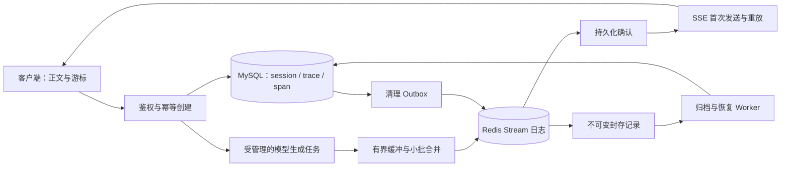

# 方案：Span 持久化、多 agent 归属与上下文压缩字段

状态：已批准，采用方案 A。更新日期：2026-09-30。

session / trace / span 三表的划分不变：session 是左侧一条会话，trace 是一轮用户请求，span 是这一轮里的一步。本方案调整三件事：生成过程中怎么写 Span；Span 表怎样支持以后的多 agent 编排；上下文压缩的数据放在哪里。

## 需求要解决的问题

现在 `ChatReplyService.stream_reply` 在推送每个片段之前，都同步打开一次数据库，把越来越长的全文整段写回同一条 Span。这有两个问题：写入量随正文长度按平方增长；同步的数据库调用会卡住异步事件循环。接入真实模型后，输出更长、并发更高，这两点都会放大。

后续还有两项需求，需要现在就在表结构上留好位置：

- 多 agent 系统由 workflow 编排。要能看出每条 Span 属于哪个 agent、在哪个节点执行、由谁调用。
- 上下文压缩。单步的长输出要能用摘要代替原文送给模型；对话很长时，要能用一段总结代替前面的若干轮。

可靠性的要求是：进程被直接杀掉时，正在生成的这一轮可以丢，这一轮标为失败，用户重新发送即可。已经完成的轮次不能受影响。

## 候选方案

### 方案 A：内存累积，结束时写一次 Span

开始回复时，在一个事务里写入 `running` 的 trace 和 Span。生成期间正文只在内存里累积，不写库。正常结束、模型报错、客户端断开时，在 `finally` 里把累积的正文和最终状态写入一次。只有进程被直接杀掉，才会丢这一轮的正文。

同步数据库调用放到有上限的线程池里执行，不在事件循环里直接调用。

应用启动时，把超过时限仍为 `running` 的 trace 和 Span 标为 `failed`，页面上不会留下永远显示「正在回复」的轮次。

### 方案 B：Redis Stream 日志，归档到 MySQL

每批正文先追加到 Redis Stream，等 AOF 刷盘确认后再发送。封存后由 Worker 归档到 MySQL Span，再清理 Redis。已发送的正文在进程崩溃后仍可恢复，也支持跨实例续传。完整设计见文末附录。

### 方案 C：MySQL 增量事件表

每批正文先插入一张追加表并提交，再发送。结束时把各批归并进 Span。已发送的正文可以恢复，而且数据只在一个事务存储里。代价是每批都有一次提交，还要多一张表和一套归并、清理流程。

## 对比

| | 方案 A | 方案 B | 方案 C |
| --- | --- | --- | --- |
| 复杂度 | 低。改写流服务，加启动清理 | 高。Lua 追加、租约、封存、归档与恢复 Worker、outbox、续传接口 | 中。事件表、归并和清理 |
| 改动范围 | `ChatReplyService`、启动流程 | 后端流式链路整体重写，前端要维护游标和去重 | 流服务和一张新表 |
| 风险 | 进程崩溃时丢这一轮 | 当前 Redis 为 `appendfsync everysec`、无副本，每批确认最长约等 1 秒，正文会按秒成批出现 | 每批提交的延迟需要压测 |
| 后续扩展 | 需要时可加定时追加写，缩小丢失范围 | 支持断线续传和多实例 | 可以演进成可恢复的流 |

## 推荐方案

推荐方案 A。

丢掉崩溃那一刻正在生成的一轮是可以接受的，而方案 B、C 的成本都花在消除这个窗口上。方案 A 同时解决了现在的两个问题：不再逐片段整段改写，也不再阻塞事件循环。

## 不采用其他方案的原因

不采用方案 B。它要求独立的 Redis 实例、AOF 刷盘确认和副本拓扑，现在都不具备。在当前 `everysec` 配置下，每批等待刷盘确认会拖慢首字和后续推送。封存、归档竞争和清理协议也还没有经过完整复核。

不采用方案 C。它解决的也是「已发送即可恢复」，而这一点已经不作要求。每批一次提交和额外的归并流程，没有换来需要的收益。

## 推荐方案的设计

### 写入时机

1. 发送时，在一个事务里创建 `running` 的 trace 和第一条 Span，更新会话标题和更新时间。
2. 生成期间正文只在内存里累积，推送片段时不写库。
3. 正常结束时写入正文，Span 和 trace 都标为 `complete`，再发 `done`。
4. 模型报错或客户端断开时，写入已累积的正文，Span 和 trace 标为 `failed`。
5. 所有数据库调用放到线程池里执行。
6. 应用启动时，把开始时间早于时限仍为 `running` 的 trace 和 Span 标为 `failed`。时限初始为 10 分钟，要大于单轮最长生成时间。多实例部署前，要改成按实例或按心跳判断，避免误伤其他实例正在进行的回复。

### Span 字段

| 字段 | 说明 |
| --- | --- |
| `id`、`trace_id`、`sequence` | 保持不变。`sequence` 是这一轮里所有 Span 的执行顺序 |
| `type` | `agent`、`llm`、`tool_call`、`mcp_call`、`thinking`、`text`、`human_input` |
| `status` | `running`、`complete`、`failed` |
| `parent_span_id` | 父 Span，可为空。agent 调用的模型、工具、MCP 是它的子 Span |
| `agent_name` | 所属 agent 在 agent 工厂里的注册名，可为空。子 Span 也记一份，按 agent 统计时不必逐层向上查 |
| `node` | workflow 节点名，可为空。节点和 agent 不一定一一对应 |
| `visible` | 是否进入用户看到的气泡 |
| `model` | 模型名，只有 `llm` 类型的 Span 填写，其他为空 |
| `text` | 这一步的输出原文，类型改为 `MEDIUMTEXT`，写入上限见下文 |
| `truncated` | 原文是否因超过上限被截断 |
| `summary` | 单步摘要，可为空。拼模型上下文时有值用它，为空用 `text` |
| `summarized_at` | 摘要生成时间，可为空 |
| `tokens`、`summary_tokens` | 原文和摘要的 token 数，可为空，供判断何时压缩 |
| `started_at`、`ended_at` | UTC，`DATETIME(6)` |

`summary` 只用于给模型拼上下文，不改写 `text`，页面始终显示原文。摘要可以晚于 Span 生成，可以重算，也可以一直为空，它不影响这一轮是否完成。

### 控制数据量

Span 的体积主要来自正文，而不是条数。有两处必须限制。

**`llm` 类型的 Span 只存输出，不存提示词。** 每次调用模型时的完整提示词都包含之前的全部对话。一轮调用 5 次模型，就会把同一段历史存 5 遍；对话越长，每份越大，总量接近平方增长。所以 `llm` Span 只记输出、`model` 和 token 数。需要看提示词时，从 trace、Span 和跨轮总结重新拼出来。重新拼出的内容按当时的拼接规则得到，与那次实际发送的提示词未必逐字一致；以后如果需要逐字审计，要另行记录提示词模板的版本。

**单条 Span 的原文设写入上限。** 工具原样返回的结果可能很大，例如查日志、查设备列表，一次就有几 MB。写入 `text` 时，初始上限为 64 KiB，按 UTF-8 字节计算，在字符边界截断，不截出半个汉字，并把 `truncated` 标为真。以后确实需要完整结果，再存到对象存储，Span 里只放地址。本次不接对象存储。

### 多 agent 归属

每次调用一个 agent，开一条 `agent` 类型的 Span。它执行中调用的模型、工具、MCP 都挂在它下面。同一个 agent 在一轮里被调用两次，就是两条 agent Span，按 `sequence` 区分。

Span 由 LangChain 回调统一写入，agent 代码自己不写。回调的开始、结束事件带有本次运行编号和父级运行编号，分别对应 Span 的编号和 `parent_span_id`；LangGraph 的节点名对应 `node`，再按节点查到 `agent_name`。接入时，按当时的 LangChain、LangGraph 版本核对具体事件名和元数据字段。

### 页面恢复规则

打开已有会话时，每条 trace 先放用户消息，再放助手消息。助手正文只拼接 `visible` 为真的 `text` Span，按 `sequence` 排序。中间 agent 的输出即使是文字，也不进入气泡。

### 上下文压缩的分工

- 单步压缩用 Span 上的 `summary`，例如很长的工具输出。
- 跨轮总结不放进 Span。它不属于某一轮的某一步，也可能发生在两轮之间，而且会被重新生成。以后单独建一张会话级的 `context_summaries` 表，字段为 `session_id`、`until_trace_id`、`summary`、`tokens`、`created_at`。拼上下文时，取该会话最新一条总结，再接上 `until_trace_id` 之后各轮的原文。页面不读这张表。它只存可以删掉重算的派生总结，不是第二份聊天记录。

压缩不删除、不改写任何 trace 和 Span，页面看到的内容不变。

### 模拟阶段的写法

模拟回复只写一条 Span：`type` 为 `text`，`visible` 为真，`parent_span_id`、`agent_name`、`node`、`model`、`summary` 为空，`truncated` 为假。模拟回复不到 64 KiB，但写入时同样经过上限检查。

### 表结构变更

`create_all` 只会创建缺失的表，不会给已有的 `spans` 表加列。开发库和测试库里的 Span 只有模拟回复，按新结构重建 `spans` 表，不做兼容迁移。

### 不做的内容

不建 `context_summaries` 表，不生成摘要，不实现压缩。不接真实模型和 LangChain 回调。不做断线续传。不改 SSE 事件格式。

## 附录：未采用的生产候选：Redis Stream 日志

<details>
<summary>展开方案 B 的完整设计</summary>

## 1. 背景

项目正在从模拟回复接入真实 AI 流式生成。现有结构中，session 表示用户的一段会话，trace 表示一次用户请求，span 表示这一轮中的执行步骤。目前一次模拟生成对应一个 `text` Span；未来一个 Trace 可以包含模型调用、工具调用等多个 Span，不能把整个 Agent 应用的所有调用固定成一个 Span。

当前 `ChatReplyService.stream_reply()` 在发送每个 chunk 前同步打开数据库会话、更新累计正文并提交。它可以较早保存部分回复，但数据库延迟会进入逐段发送路径，同步数据库调用还会占用异步事件循环。真实模型的输出频率、并发量和持续时间增加后，反复更新不断增长的正文会放大数据库开销。

只在回复结束后写库可以降低写入频率，但应用进程在生成中途崩溃时，已经展示给用户的正文可能只存在内存中。直接启动一个后台异步任务也不能消除这个窗口。因此，需要一份独立于应用进程、可以重放的生成日志，并明确客户端发送、数据库归档和日志清理之间的先后关系。

项目已有 MySQL 和 Redis，Redis 当前还承担登录态与验证码。生成日志的容量、持久化和淘汰要求更严格，生产环境需要独立配置；不能因为已有 Redis 连接，就认定当前部署满足这些条件。

## 2. 目标与保证范围

推荐采用 **Redis Stream 保存生成期增量，MySQL 保存最终 Span，所有正文发送都经过持久化确认** 的方式。它适合当前已有 MySQL、Redis 的技术栈，并保留一条 Span 主记录保存最终结果的结构。

### 2.1 明确承诺

1. 在 Redis 已确认的日志历史仍然可用的前提下，任何已发送给客户端的正文事件，在应用进程被 `kill -9`、实例重启或生成任务异常后都可恢复。
2. 正文事件先写入日志并达到配置的持久化确认要求，才允许从任何实例发送，包括首次发送和断线重放。
3. 客户端以 `span_id + run_id + event_seq` 去重。网络允许重复投递，页面不重复追加已处理内容；不宣称网络层 exactly-once。
4. MySQL 归档提交成功后才能对客户端声明持久化完成。`done` 不能表示“已经投递了一个未来可能执行的后台写库任务”。
5. 正常路径争取每条 Span 主记录一次 INSERT、一次最终 UPDATE。Trace、请求幂等记录、清理 outbox、故障恢复和重试可能产生额外写入；可靠性优先于严格的“整个数据库只写两次”。
6. 应用进程崩溃后可重放已保存输出，但通常无法恢复供应商内部的模型生成状态。继续生成需要显式发起新的调用、新 Span，并记录关联关系。

### 2.2 不作无条件承诺的情况

| 故障或需求 | 本方案边界 |
| --- | --- |
| 应用进程崩溃，Redis 日志保留 | 已发送正文 RPO 为 0；恢复时间取决于租约、扫描积压和存储可用性 |
| Redis 进程重启、磁盘仍完好 | 依赖 AOF、fsync 确认和磁盘正确兑现持久化；需要故障演练 |
| Redis 主从切换、网络分区、恢复旧备份 | 普通 Redis 复制不提供任意故障切换下的无条件零丢失保证；暂停新发送并核对日志，可能需要人工处理 |
| Redis 所有确认副本及其持久盘同时丢失 | 无法凭空恢复未归档正文，需要备份/容灾；属于明确剩余风险 |
| 客户端收到数据但服务器不知道是否已展示 | 可以重放，依靠客户端游标去重；不能仅靠 socket 写成功判断用户已看到 |
| 日志超过归档后的保留期 | 从 MySQL 返回完整正文快照；不承诺永久恢复原始 chunk 切分边界 |

“恢复每个 chunk”在本方案中表示已展示正文不会缺字、顺序可恢复。在日志保留期内可以重放原始事件；保留期后恢复最终内容。若审计要求永久保留每个原始事件，需要额外归档事件日志。

如果业务要求 **Redis 故障切换、机房故障等场景也必须对所有已确认事件零丢失**，应选择经过验证的持久日志/数据库复制方案，重新评估下面的候选 C 或 D，不能把这个要求隐藏在 Redis 配置里。[Redis WAIT 官方文档](https://redis.io/docs/latest/commands/wait/)明确说明 WAIT 不会把 Redis 变成强一致存储。

## 3. 候选方案与取舍

| 方案 | 做法 | 复杂度、改动范围 | 优点 | 主要风险与扩展性 |
| --- | --- | --- | --- | --- |
| A：终态一次写库 | 生成期只缓存内存，结束时更新 Span | 低；修改现有流服务 | 吞吐开销低、实现简单 | 进程中途崩溃会丢已展示正文，不满足本次要求 |
| B：Redis Stream + 最终 Span（推荐） | 发送前追加 Redis 日志，封存后归档 MySQL | 中高；新增日志、续传、恢复、清理能力 | 避免逐段改写 MySQL 大文本，适配现有组件，可跨实例恢复 | Redis 成为未归档数据的关键存储；需要严格保留策略和明确故障边界 |
| C：MySQL 增量事件表 | 每批正文先提交到追加表，再发送；最终归并 Span | 中；增加事件表和清理流程 | 事务边界集中在一个数据库，运维组件较少 | 仍有按批提交和事件表写入；需测量真实数据库性能与复制保证，不能先假设撑不住 |
| D：持久消息日志系统 | 分区日志先确认，消费者归档 Span | 高；增加 broker、分区、消费与运维体系 | 适合大规模流式事件、多消费者及更严格的复制策略 | 小规模部署成本高；确认策略、可选领导者、保留和幂等仍需严格设计 |

推荐 B 的依据是当前要求聚焦应用进程崩溃恢复，项目已有 Redis/MySQL，且需要降低重复更新整条 Span 的开销。A 不满足可恢复性。C 是合理备选：若团队不具备可靠运营 Redis 日志的能力，或实测 MySQL 追加写的延迟可以接受，应优先选 C。D 保留给规模、消费者数量或跨节点持久性要求上升后的评估。

本方案没有“Redis 必然低于 1ms”“MySQL 必然无法承受某个 TPS”的前提。选择 B 必须以本项目的正文大小、并发、AOF、复制、磁盘和跨节点延迟压测为依据。

## 4. 总体结构与不变量



必须始终满足以下不变量：

- `可发送的 event_seq ≤ 已确认持久化的日志前缀`，重连读取也遵守。
- 一个 Span 对应一个固定 `run_id`。Redis 状态丢失后，不得在原 Span 下重建另一段日志或从 seq=1 重新生成。
- 同一 `event_seq` 对应唯一的事件类型、内容和摘要；同序号不同正文是冲突，不能当 DUP 成功。
- `SEALED` 后正文、终态和最后序号不可修改。模型继续输出、旧写者恢复或重复取消都不能改写封存结果。
- 归档只使用经过完整性校验的封存日志，不允许使用某个生产者私有的内存正文直接竞争写库。
- 未在 MySQL 确认归档的数据不自动过期、不截断、不因内存淘汰删除。
- 日志清理以 MySQL 中已提交的归档证明为依据，不能只依赖 Redis 中一个可误写的 FINALIZED 标记。

## 5. 数据模型

### 5.1 MySQL 主记录

沿用 `chat_sessions → traces → spans`。`spans.sequence` 是步骤在 Trace 中的顺序；`event_seq` 是同一 Span 内的事件序号，两者不能混用。

生产化时在 Span 上增补以下信息，具体 DDL 在后续规格阶段确定：

| 字段 | 用途 |
| --- | --- |
| `run_id`、`protocol_version` | 区分不可复用的一次运行与协议版本，避免状态丢失后出现同 ID 不同正文 |
| `status` | `running / complete / failed / cancelled / interrupted`，表示该执行步骤自身的结果 |
| `started_at`、`ended_at` | UTC `DATETIME(6)`；避免把秒级时间误当唯一顺序 |
| `seal_id`、`final_event_seq`、`snapshot_hash` | 归档来源及幂等证明 |
| `text`、`structured_output` | 可展示正文及工具调用等结构化结果；只保存允许留存的数据 |
| `usage`、`usage_source`、`finish_reason` | 用量和完成原因；异常中断时允许 unknown/partial，不能伪造完整账单 |
| `error_code`、脱敏错误摘要 | 可诊断错误，禁止存入密钥、连接串和原始内部堆栈 |

当前 `TEXT` 在 MySQL 中有字节容量限制。若生产上限设为 1 MiB，应迁移到合适的 `MEDIUMTEXT`/结构化存储，并限制输入、输出、工具参数的 UTF-8 字节数；不能仅按 Python/JavaScript 字符数限流。MySQL 使用 `JSON`，不复制参考方案中的 `JSONB`、`TIMESTAMPTZ`、部分索引或 PostgreSQL 占位符。

Trace 仍表示一次用户请求。当前单 Span 可直接推导 Trace 终态；未来多 Agent、多工具步骤时，由 workflow 统一汇总 Trace，单个 Span 归档成功不能直接宣布整个 Trace 完成。

另外需要：

- 请求幂等记录：唯一键 `(username, client_request_id)`，保存请求摘要和已分配的 Trace/Span 标识；重复键、相同请求返回同一结果，重复键、不同请求返回 409。
- 清理 outbox：最终归档事务内插入去重任务，供 Worker 在数据库提交后安全调整 Redis 保留时间。它属于控制数据，不新增第二份聊天正文。
- 查询索引：Span 的 `(status, started_at, id)` 支持恢复扫描；Trace/Span 的归属与步骤顺序保持现有索引。恢复扫描使用分页游标与重试调度，不能每次只取最老 200 条，长期活跃记录会饿死后续记录。

### 5.2 Redis 运行数据

建议使用独立的生成日志 Redis 实例，避免登录态、验证码、缓存的淘汰或清理影响唯一的未归档正文。Redis 逻辑数据库与 key 前缀不能隔离实例级内存及持久化配置。

每个 Span 的 key 使用同一 hash tag：

- `span:{span_id}:meta`：`run_id`、`producer_epoch`、owner、状态、租约截止时间、最后序号、累计字节、封存元数据、控制屏障计数等。
- `span:{span_id}:events`：Stream。使用稳定递增 `event_seq-0` 作为 ID，记录事件类型、规范化 payload、payload 摘要和协议版本。

正文和工具参数的增量需要保留 `tool_call_id` 等归属，不能简单把多个工具的参数片段拼成一个 JSON。只保存供应商允许暴露和业务批准留存的内容；内部推理信息不能默认全部存储或下发。

Redis 元数据是运行期协调信息；MySQL 终态 Span 是归档后的查询依据。未归档期间正文的唯一完整来源可能是 Redis，因此它承担数据存储职责，不能按普通可丢缓存管理。

## 6. 写入与发送协议

### 6.1 创建与恢复句柄

1. 客户端发起请求时提供 `Idempotency-Key`。服务端验证 `satoken`、session 归属、输入大小和资源配额。
2. 在 MySQL 事务中登记请求、Trace、初始 Span、固定 `run_id`。重试同一请求不会再次调用模型。
3. 原子初始化 Redis 元数据。初始化重试只接受相同 `run_id`；不得接管一个已有运行。若初始化响应超时，先核对状态，不能直接覆盖。
4. 完成上述步骤后立即发送 `accepted` 控制事件，提供 `trace_id`、`span_id`、`run_id`、协议版本和恢复接口。客户端在首段正文前即可持有句柄；若 accepted 丢失，通过幂等重试找回。
5. 启动由应用生命周期管理或独立 Worker 管理的模型任务。模型任务与某个 HTTP 订阅连接解耦；不能使用无人持有、无人等待异常的临时后台任务。

若登记后实例立即崩溃，数据库中仍有可扫描记录；恢复流程会处理初始化未完成的情况。是否自动重试尚未发起的模型请求必须由任务状态和供应商幂等能力证明，不能根据“没有看到 chunk”猜测模型从未执行。

### 6.2 增量追加

模型读取器进入按**字节数和条数双重限制**的队列。单个日志写者按最多 20–50ms 或 4–8 KiB 合并增量。首段不等待合并定时器，但仍必须等待日志确认。

一次追加需要原子验证 `run_id`、epoch、状态和租约，并遵守：

- 只接受 `event_seq = last_seq + 1` 的新事件。
- 重试已有序号时读取原事件并比对类型及 payload 摘要；相同才返回 DUP，不同返回冲突并停止该运行。
- 先检查 key 类型、参数、总输出上限和所有可预先验证的条件；不得将 Lua 的无交错执行误认为带关系型事务回滚。
- 原子更新事件、last_seq 和累计字节。脚本中途报错或返回值不确定时，核对 Stream 尾部与 metadata；确认一致前不得向客户端发送，也不得跨过缺口继续写入。
- 未归档日志不设置会自动删除数据的兜底 TTL。孤儿数据通过带数据库核验的恢复/清理任务处理。

Lua 实现必须覆盖命令报错、错误 key 类型、OOM、脚本缓存丢失和连接重试；仅提供正常路径脚本不满足上线条件。[Redis Lua 文档](https://redis.io/docs/latest/develop/programmability/eval-intro/)解释了原子执行和运行时错误的语义。

### 6.3 持久化确认与重放发送

生产部署要求 Redis 支持所选择的确认能力。建议采用仍受支持、已修补且包含 `WAITAOF` 的版本（功能下限为 7.2），独立实例开启 AOF；主节点和被要求确认的副本使用经过验证的 fsync 策略。默认目标可设为本地及至少一个副本完成 AOF fsync，具体拓扑需在上线前确认。

追加脚本与后续 `WAITAOF` 必须使用**同一条固定连接**，并检查实际返回的本地/副本确认数量。超时不代表成功，也不代表写入没有发生；未满足门槛时暂不发送正文，通过同序号幂等核对解决不确定结果。`WAITAOF` 不能放进会阻止其等待的 Lua/MULTI 上下文。

重连后仅执行一次“返回 DUP 的只读检查”不足以让新连接上的 `WAITAOF` 覆盖旧写入。重试校验成功后，需在该 Redis 历史中执行一次真实的控制屏障写，再在同一连接等待确认。

**续传接口也必须经过确认。**它可能读到其他生产者刚 XADD、尚未完成持久化确认的事件。重放读取一页事件后，在同一主节点连接执行控制屏障写并等待确认，再发送该页；不能把“已能 XRANGE 读到”当作“已达到持久化门槛”。连接或主节点变化会使该次确认失效，需要重新验证。

这是本方案选择的生产策略，确实增加 Redis I/O 延迟与往返；它没有“首字零额外开销”的承诺。若无法接受这个延迟，应调整持久性目标或改选其他方案，不能悄悄先发后写。[WAITAOF](https://redis.io/docs/latest/commands/waitaof/)只确认当前连接此前写入的 AOF fsync；[WAIT](https://redis.io/docs/latest/commands/wait/)只确认复制接收，两者均不能无条件消除所有故障切换风险。

## 7. 封存、归档与旧写者隔离

### 7.1 生成写者的隔离

同一 Span 只有一个生成写者。所有追加、心跳和封存都校验 `run_id + producer_epoch`。租约以 Redis 服务端时间判断；心跳间隔初始可用 5s、租约 30s，最终值由进程调度停顿、网络和持久化延迟实测确定。

恢复任务通过 Redis 原子操作确认租约过期，递增 epoch，并把当前日志封存为 `interrupted`。**恢复任务只封存已存在的前缀，不在同一 Span 中继续调用模型。**旧写者恢复后因 epoch 不符而停止；已获得确认、尚未发送的旧批次仍属于被保存的日志前缀，不会造成正文缺失，但可能进入客户端去重流程。

租约无法完美区分进程死亡与长时间暂停。误判会中断一次仍可能继续的生成，这是可用性代价；应记录误接管指标，不能宣传“绝不误判活跃进程”。

### 7.2 一次性不可变封存

Redis 状态为 `STREAMING → SEALED → FINALIZED`。正常完成、模型错误、显式取消与恢复封存竞争同一个原子操作，只有首次合法封存生效。

封存清单固定 `run_id`、唯一 `seal_id`、最后正文事件序号、累计字节数、终态、完成原因和可获得的 usage。已封存时返回既有清单，不能替换状态或再追加另一个结束结果。Stream 中另存内部 seal 标记，序号与正文序号边界明确；内部 seal 不是公共 `done`。

`SEALED` 表示生成期数据已固定，尚不表示 MySQL 已归档。正常连接及恢复连接均可报告“正在保存”，但只有数据库事务提交后才发送完成确认。

### 7.3 归档事务与幂等校验

归档者读取封存清单，分页读取固定范围的日志，验证 `run_id`、连续序号、payload 摘要和总字节数，组装各类输出并计算规范化快照摘要。缺项、冲突或无法验证时进入恢复待处理并告警，不能写入一个看似正常的空结果。

在一个 MySQL 事务中：

1. 只更新固定 `span_id + run_id` 下仍为 `running` 的记录，写入正文、终态、`seal_id`、最后序号、快照摘要、用量和结束时间。
2. 按当前 workflow 规则更新 Trace 终态；未来多 Span 情况必须等待流程真正结束。
3. 插入唯一的 Redis 清理 outbox 任务。

条件更新影响 0 行时必须读取既有归档，比较 `run_id / seal_id / final_event_seq / snapshot_hash / status`。完全相同才是幂等成功；不一致属于数据冲突，不能简单忽略。

这里对先前评审中的“必须加 SQL epoch”作更精确的限定：Redis epoch 负责阻止旧生成写者追加；数据库归档依赖**同一个不可变封存结果**。如果所有归档者都只读取相同清单和日志，旧归档者重复提交相同结果是安全的，不必因为 epoch 变化拒绝相同快照。反之，只要允许从内存正文直接写库、改写 seal 或重建同 ID 日志，这个证明就不成立，必须另加数据库 fencing 协议。

该简化只在单一、未回退的 Redis 日志历史假设下成立。Redis 分裂历史或回退快照可能产生冲突 seal，不能靠 `WHERE status='running'` 修复；此类故障暂停自动归档并核对，见风险表。不能把 Redis 中的 epoch 单独当成跨系统强一致事务。

### 7.4 安全清理

归档事务提交后才能标记 Redis FINALIZED，并为已归档数据设置保留期（初始建议 10 分钟）。清理 Worker 根据 outbox 重试该动作，验证 `span_id + run_id + seal_id` 与数据库一致。

若进程在数据库提交后、设置 Redis TTL 前崩溃，outbox 仍会驱动清理；不能因为数据库记录已经是终态、不再进入恢复扫描，就永久漏掉这批 Redis 数据。

MySQL 长时间不可用时，SEALED 数据继续保留。达到容量阈值后拒绝新生成，不能用 24h TTL 删除尚未归档的唯一正文来维持可用性。

## 8. 客户端续传与接口契约

保留现有 `/chat-sessions/{id}/replies` 入口，生产协议升级为显式版本。新增按完整归属链访问的 Span 事件订阅入口，示例：

`GET /chat-sessions/{session_id}/traces/{trace_id}/spans/{span_id}/events`

每次创建、查询、续传、取消都验证 `satoken → 当前用户 → session → trace → span`。ID 随机不构成访问权限。继续使用支持自定义 `satoken` 请求头的 fetch SSE 客户端，不把 token 放进 URL。

正文 SSE 事件采用：

```text
id: <span_id>/<run_id>/<event_seq>
event: chunk
data: {"text":"已持久化的增量"}
```

- 客户端以 Span 为消息主键，以最后一个**已应用到正文**的序号为游标；重复序号不重复追加，发现缺口则从最后连续位置重放。
- 游标和对应正文必须一致。若浏览器只保留游标却没有正文，不得从该游标续接；应从 0 重放或获取完整快照。需要跨页面重载保存时，两者应原子保存。
- 服务端验证游标属于该 Span/run，序号非负且不超过已有日志/已归档范围。格式错误、跨运行游标或未来序号返回明确错误，不静默跳过正文。
- `XRANGE` 分页补齐历史后，用最后实际读取的 Stream ID 调用 `XREAD`，不能用 `$` 跳过切换窗口内的新事件。[XREAD 文档](https://redis.io/docs/latest/commands/xread/)定义了按给定 ID 之后继续读取的语义。
- 日志已清理时，只有 MySQL 确认完整归档才返回 `replace`：包含 Span/run、最终序号、正文、状态和摘要，客户端替换整条助手正文，不进行追加。
- Redis 不存在但 MySQL 仍为 running，不等于“已经落库”。返回恢复待处理状态并告警；不返回空正文作为完成结果。
- 首次发送和重放走同一套持久化确认与顺序规则。已发送不等于用户已看见，不依赖网络层 exactly-once。

当前单 Span 场景可沿用 `done` 携带 Trace/Span ID；它还应携带归档标识和最终序号。未来多 Span 引入 `span_done` 表示单步骤归档完成，整个 Trace 的 `done` 由 workflow 发出，不能由任意一个 Span 自行宣布。

## 9. 并发、断线与恢复任务

模型读取器、日志写者和心跳属于一个受管理的任务组，异常必须传播并清理兄弟任务。HTTP 订阅者属于独立任务，客户端变慢或断线只移除订阅，不拖住日志写者、不取消已经被接受的模型任务；显式取消走独立、幂等的业务接口。

- 使用有界队列限制待写事件数和字节数。超限时向模型读取施加背压；供应商流不支持有效背压或长时间写入停顿时，按期限取消，保留已确认日志。
- 客户端有独立发送缓冲与超时。慢客户端断开后可续传，不能让其 socket 阻塞扩大模型内存队列。
- 心跳、生成任务和连接任务均须被取消并等待结束。`asyncio.gather` 默认不会在一个子任务失败时自动取消所有其他任务；实现应使用明确的结构化清理策略。[Python asyncio 文档](https://docs.python.org/3/library/asyncio-task.html)
- 数据库连接与事务不得跨整段模型生成保持打开。采用异步驱动，或把同步数据库 I/O 放到有上限的工作线程池；单纯改成 `async def` 不会让同步 SQL 调用不阻塞。
- 显式取消需要获得 durable seal 或可恢复的取消指令确认后，才能告诉用户“已取消”。Redis 不可用时不能虚报取消成功。工具已经产生的外部副作用不因取消而自动撤销。

恢复 Worker 按索引扫描数据库中的未归档记录，逐项查询 Redis 状态：

| 情况 | 动作 |
| --- | --- |
| STREAMING，租约仍有效 | 跳过，不因 started_at 较早就强制中断 |
| STREAMING，租约已过期 | 原子隔离旧生产者并封存为 interrupted，然后归档已保存前缀 |
| SEALED，数据库未归档 | 校验清单与日志并重试归档，不改变原终态 |
| 数据库已有相同归档，Redis 尚未清理 | 幂等确认，交给清理 outbox |
| Redis 缺失、序号有缺口、摘要冲突 | 停止自动成功归档，登记恢复待处理并告警；禁止重建同一运行或写空正文掩盖丢失 |
| 存储暂时不可用 | 有上限的重试与退避；超过预算后进入可观察的待处理队列，不形成无限高速重试 |

需要多个 Worker 时，同一封存结果允许重复读取和幂等归档；不要依靠“恢复 Worker 永远只运行一个”保持正确性。任务分片、分页和失败重试必须防止一批长期运行或异常记录阻塞其他 Span。

## 10. 配置、容量与安全

以下数值只作为压测起点，不是已经验证的生产配置：

| 项目 | 起始建议 | 调整依据 |
| --- | --- | --- |
| chunk 合并 | 20–50ms 或 4–8 KiB，首段无合并等待 | 首字/后续事件延迟和存储确认耗时 |
| 待写队列 | 同时限制 256 条及 256 KiB/Span | 模型突发速率、写入停顿和进程内存 |
| 单 Span 输出 | UTF-8 总字节默认上限 1 MiB | 真实 Agent 输出与工具参数分布 |
| 单次生成时限 | 初始 10 分钟，业务可单独配置 | 供应商超时、工具最长执行时间 |
| 心跳/租约 | 5s / 30s | 事件循环停顿和网络 p99，而非只按比例猜测 |
| 恢复扫描 | 初始每 5s、分页 100 条 | 实际积压、数据库负载与恢复 SLO |
| 已归档日志保留 | 初始 10 分钟 | 重连比例和快照替换成本 |
| 未归档日志 TTL | 不自动删除 | 以配额、背压、准入和人工故障处理控制容量 |

Redis 开启 `noeviction`，对新请求设置全局、租户和模型并发配额，并计算未归档数据的预留容量。内存核算包括 Stream/Hash 元数据、分配器碎片、客户端缓冲、复制缓冲与 AOF rewrite 峰值，不能只算文字字节数。数据库停写时要根据剩余容量提前停接，而非等 OOM 后再处理。

Redis AOF `everysec` 存在近期写入丢失窗口；高可用副本不能自动消除这个窗口。持久化确认和故障切换政策需运维验收，MySQL 的提交刷盘、binlog 和复制策略也要一起核对。[Redis 持久化文档](https://redis.io/docs/latest/operate/oss_and_stack/management/persistence/)、[MySQL InnoDB 参数](https://dev.mysql.com/doc/refman/8.4/en/innodb-parameters.html)

连接使用 TLS、最小权限和私网访问；Redis ACL 只允许必要命令和 key 范围。凭据沿用环境/本机私有配置，不进入文档、日志或 SSE。文本与工具参数按用户隔离、数据分类和保留政策处理；日志指标只记录 ID、字节量、序号和脱敏错误，不默认打印模型正文。

## 11. 风险与应对

| 风险 | 影响 | 预防/处置 | 剩余限制 |
| --- | --- | --- | --- |
| Redis 故障切换回退或出现不同历史 | 已确认日志、epoch 或 seal 可能回退 | AOF/副本确认、拓扑变更暂停发送、核对日志；更严格目标改选持久日志或数据库方案 | Redis 方案不能承诺任意分区和切换下绝对零丢失 |
| MySQL 长期故障 | 日志堆积、无法发出已归档 done | 保留未归档数据、停止新请求、清理 outbox 和恢复队列可观测 | 可用性下降；磁盘/内存容量仍有限 |
| 生产者停顿超过租约 | 活跃调用被当作中断 | 保守租约、运行时监控、epoch 拒绝旧写入 | 不能同时保证无限容忍停顿与快速故障恢复 |
| 追加响应超时或脚本部分失败 | 重复事件、meta/log 不一致 | 原序号原内容重试、摘要核对、故障注入、异常即停发 | 无法证明完整时必须待处理，不猜测修复正文 |
| 封存与归档并发 | 冲突终态覆盖 | 不可变 seal、固定 run、完整性校验、SQL 条件更新后比较归档证明 | 依赖单一 Redis 日志历史，不能容忍静默重建 |
| 客户端慢或反复重连 | 内存放大、重复显示、查询负载 | 有界订阅缓冲、游标去重、续传鉴权与限流 | 只能保证有界资源下的服务水平 |
| 同一创建请求重试 | 重复模型费用或工具副作用 | 持久幂等键、请求摘要、新生成使用新 Span | 外部工具仍需要自己的幂等/补偿设计 |
| Redis 日志被缓存清理或误删 | 未归档正文丢失 | 独立实例、ACL、禁止活跃 key TTL、清理核验 | 管理员误操作和全部存储损坏仍需备份/应急机制 |
| 日志留存扩大敏感数据暴露面 | 数据安全和保留合规风险 | 最小记录、加密访问、权限核对、终态保留和审计删除流程 | 合法删除流程可能有意终止历史恢复能力 |
| 生成完成但 usage 未返回 | 计费信息不完整 | 明确 unknown/partial 来源，后续对账单独记录 | 不能从可见文本精确还原供应商计费 |
| DB 两次写入被当成硬指标 | 为少写一次而跳过恢复控制 | 统计主记录与控制写入，允许 outbox/恢复重试 | 总 SQL 次数高于两次是正常情况 |

严格模式下，Redis 不可用时不能降级为“内存缓存后直接发送”，那会破坏核心承诺。应拒绝新生成或暂停未确认正文发送；界面明确提示等待/恢复状态。开发演示若保留不可靠模式，必须显式标记，不能与生产保证混用。

## 12. 项目落地与上线条件

模型继续继承 `CrudModel`。单表查询留在模型，跨 MySQL、Redis、模型流与任务生命周期的业务放 Service；采用构造注入便于替换测试依赖。可拆分为 `SpanJournal`、`SpanArchiveService`、`SpanRecoveryService` 与订阅服务，避免把所有状态逻辑写入路由。Agent/Graph 仍负责模型步骤和工具编排，传输与归档不决定下一个 Agent。

落地重点：

1. 基于本方案更新计划/规格，固定状态机、错误码、幂等键、游标格式和故障保证范围。
2. 增加版本化 MySQL 迁移、回滚/兼容方案及初始化脚本。`create_all(checkfirst)` 只能补缺失表，不能承担已存在表的字段和索引迁移。
3. 新旧运行按 `protocol_version` 路由。旧 Span 保持既有读取行为，不伪造 Redis 日志或恢复游标；原本未保存的历史回复无法补造。
4. 先做影子日志写入与内容比较，再对小流量开启“日志确认后发送”。每个运行只选择一种写入/归档责任链，避免两套归档者同时竞争。
5. 回滚只影响新请求；已进入新协议的活动日志必须继续消费、归档与清理，不能直接关闭 Worker 或删除 key。

上线前应提交可重复执行的故障测试证据，不能用普通单元测试通过代替：

- 在 SQL 登记、Redis 初始化、追加成功未确认、确认未发送、发送后、封存后、SQL 提交后未清理等位置强制退出进程；验证客户端收到的事件均可重放或被最终快照覆盖。
- 模拟追加响应丢失并换连接重试，确认相同 seq 不重复、不同 payload 被拒绝；重放者在生产者确认前读取事件时也不能提前发送。
- 暂停旧写者超过租约后恢复，验证其追加被拒绝；同时运行多个归档者，证明最终 seal/hash 一致且没有终态覆盖。
- 数据库停写超过原拟议的安全 TTL，确认未归档日志仍保留并触发新请求限流；恢复后可以补归档。
- Redis 断连、OOM、AOF 写失败、重启和主从切换分别演练。对超出保证范围的情况必须显式报告日志完整性异常，不能伪造成功。
- 跨实例续传、重复序号、缺口、非法/跨 Span 游标、无权限访问、日志清理后的 replace、客户端正文和游标不一致。
- 两倍预期峰值的持续压测，记录首字与事件延迟 p95/p99、Redis 持久化确认延迟、队列字节、未归档字节、最老 SEALED 时长、恢复积压和 MySQL 归档耗时。参数根据这些数据确定。

必须为日志完整性错误、归档长期滞留、容量不足、持久化确认失败和异常接管配置告警与处置手册。发布验收还需确认实际 Redis 版本/AOF/副本策略、MySQL 持久化设置、最大并发与响应大小、数据保留时限及恢复 SLO；本文没有把未经测量的参数当成现网事实。

## 13. 参考资料与评审状态

以下为设计依赖的官方资料，Redis 命令行为应按部署版本再次核对：

- [Redis Streams](https://redis.io/docs/latest/develop/data-types/streams/)：事件日志及按 ID 读取。
- [Redis persistence](https://redis.io/docs/latest/operate/oss_and_stack/management/persistence/)：AOF、fsync 策略与风险。
- [WAITAOF](https://redis.io/docs/latest/commands/waitaof/) / [WAIT](https://redis.io/docs/latest/commands/wait/)：持久化/复制确认的条件与边界。
- [Redis Lua scripting](https://redis.io/docs/latest/develop/programmability/eval-intro/)：原子执行、错误处理和脚本缓存。
- [XREAD](https://redis.io/docs/latest/commands/xread/)：续传读游标语义。
- [Python asyncio tasks](https://docs.python.org/3/library/asyncio-task.html)：任务组、异常传播和取消。
- [MySQL InnoDB parameters](https://dev.mysql.com/doc/refman/8.4/en/innodb-parameters.html)：数据库提交持久化配置。

本次已依据现有代码和官方文档进行设计核对。独立审查仅返回了部分运维反馈，随后因额度限制中断；不可变封存和归档竞争协议仍需完整独立复核与故障演练。本文是待评审生产候选，不是已经部署或经过生产验证的实现。

</details>

## 附录：前期三表实现方案

<details>
<summary>展开前期设计记录（用于历史追溯）</summary>

### 原方案：会话、trace 与 span

## 需求要解决的问题

聊天回复现在由浏览器里的 `LocalTimedChunkSource` 在本地拼出来。左侧会话和消息只活在当前页面的内存里，刷新就没了。后面的 agent 运行需要留下每一轮对话，以及这一轮里面的步骤。

这一步要定三件事：

- 助手回复改由后端用 SSE 推送。模拟阶段后端可以返回固定文案。
- 一条左侧会话（session）下面有多条 trace。一条 trace 是一轮完整对话：用户发出，到这轮回复结束。
- 一条 trace 下面有多个 span。span 是这一轮里的步骤。模拟阶段只记助手正文。

登录用的 `/session` 是 Redis 里的 token，不承担聊天记录。聊天会话另走路径。当前用户只从 `satoken` 解析，沿用用户隔离里已经做好的入口。

## 第 2 步：会话建模方案

本节只确定聊天会话（session）的持久化和接口，不包含 trace、span，也不调整回复接口。当前 `User.username` 是用户表主键，鉴权中间件会把 `satoken` 对应的用户名放进请求状态。

### 候选做法

#### 做法 A：MySQL 会话表，模型承接简单业务查询

新增 `chat_sessions` 表，字段为服务端生成的 32 位十六进制字符串主键 `id`、所属用户 `username`、标题 `title`、创建时间 `created_at` 和更新时间 `updated_at`。`username` 外键指向 `users.username`。新建会话的标题为「新会话」，时间使用 UTC。

新增 `ChatSession` 模型并继承 `CrudModel`。`CrudModel` 继续提供通用增删改查；`ChatSession` 增加本模型范围内的简单业务方法，例如按用户名列出会话、按会话编号和用户名读取会话。路由从鉴权状态取得用户名，不接受请求体提供的用户名作为归属依据。当前阶段不单独增加 Service。

接口为 `GET /chat-sessions`、`POST /chat-sessions` 和 `GET /chat-sessions/{id}`。列表只返回当前用户的会话，按更新时间从新到旧排列。编号不存在或不属于当前用户时统一返回 404「会话不存在」。前端进入聊天页时读取列表；若列表为空则创建一条会话。侧栏的新建和切换改为调用这些接口。

trace 阶段再根据首轮用户输入更新标题，并随 trace 更新会话的 `updated_at`。本阶段不提前加入这部分跨模型业务流程。

#### 会话标题修改接口候选

会话需要支持用户手动改名；首轮提问后还会生成默认标题。自动标题只在标题仍为「新会话」时写入，已手动改过的标题不被自动覆盖。

##### 做法 A：PATCH 会话资源

`PATCH /chat-sessions/{id}`，请求体为 `{"title":"新标题"}`。路由按当前用户校验归属，保存标题并更新时间，返回更新后的会话对象。空标题或超过 255 个字符时拒绝。

##### 做法 B：PATCH 标题子资源

`PATCH /chat-sessions/{id}/title`，请求体同样为 `{"title":"新标题"}`。其归属检查、校验、更新时间和响应与做法 A 相同。

| 做法 | 复杂度 | 改动范围 | 风险 | 后续扩展 |
| --- | --- | --- | --- | --- |
| A：PATCH 会话资源 | 低 | 增加一个路由和前端 API | 开放更多字段时需维护允许修改字段 | 可按需扩展会话可编辑字段 |
| B：PATCH 标题子资源 | 低 | 增加一个独立标题路由和前端 API | 与其他会话字段的更新接口风格可能不一致 | 适合标题成为独立业务子资源的情况 |

推荐做法 A。它以标准部分更新表达对会话资源的修改；请求模型当前只接受 `title`，不会开放归属用户或其他字段更新。首轮问题仍按既定规则生成默认标题；若用户已改名，自动标题不覆盖用户的标题。

#### 做法 B：MySQL 会话表，查询放在独立 Repository 或 Service

表结构、接口和前端行为与做法 A 相同。额外增加 Repository 或 Service，集中处理会话创建、用户过滤和读取；模型仅负责字段定义和通用 CRUD。

这种分层在查询涉及多个模型、事务或复杂业务规则时更易扩展。但当前需求只有一张表和几项直接查询，会多出一层对象与文件，且与现有 `CrudModel` 的职责分配重复。

#### 做法 C：Redis 保存聊天会话

按用户名在 Redis 中存会话列表和会话内容，仍提供相同的接口。

Redis 可快速读写，但项目目前只用它保存 token 和验证码。会话历史需要长期保存、排序并关联后续 trace/span，使用 Redis 会额外引入数据结构与过期策略，后续关系查询也不如 MySQL 直接。

### 对比

| 做法 | 复杂度 | 改动范围 | 风险 | 后续扩展 |
| --- | --- | --- | --- | --- |
| A：MySQL 模型查询 | 低 | 会话模型、路由、启动建表、前端 API | 低；归属由鉴权用户名约束 | 可直接关联后续 trace |
| B：MySQL 加 Repository/Service | 中 | 做法 A 的改动，并增加查询层 | 简单查询可能造成职责重复 | 多模型流程和复杂规则出现后易扩展 |
| C：Redis | 中 | Redis 数据结构、读写逻辑、前端 API | 需要额外维护持久化、过期与关系查询 | 与 trace/span 的关系不直接 |

### 推荐做法

推荐做法 A。模型保留 `CrudModel` 提供的通用 CRUD，并实现简单、只涉及会话表的查询；路由校验并传入鉴权用户名。本阶段不建立 Service。若后续业务出现跨多个模型的事务或复杂规则，再引入 Service 层承接。

不选做法 B，是因为当前查询简单，独立层会重复模型职责。不选做法 C，是因为聊天历史需要持久化并与后续 trace/span 建立关系，MySQL 更适合当前数据模型。

## 候选方案

### 方案 A：三张表，SSE 先打通再按层落地

聊天会话、trace、span 各一张表，都继承现有的 `CrudModel`。不另做仓库，也不另建消息表。

session 记当前用户的用户名、标题和更新时间。用户名只来自鉴权中间件。trace 记它属于哪条 session、这一轮的用户输入，以及状态：进行中、完成、失败。span 记它属于哪条 trace、步骤类型和文本。步骤类型与前端已有片段一致：`text`、`thinking`、`tool_call`、`mcp_call`、`human_input`、`context`。模拟阶段只写 `text`。

一条 session 有多条 trace。用户再发一句，就在同一条 session 下新开一条 trace，不把整个会话收成一条。助手正文在流结束或失败时写入同一条 span，不为每个 SSE 片段插一行。

接口分成四步，前一步不依赖后一张表：

1. `POST /replies` 用 SSE 推送模拟回复。要求 `satoken`，不写 MySQL。前端新增一种 `TextChunkSource`，`ChatSession` 仍把片段追加到同一条助手消息。
2. `GET/POST /chat-sessions` 和 `GET /chat-sessions/{id}`。侧栏改为读写这些接口。
3. 发送改为 `POST /chat-sessions/{id}/replies`。先创建 trace，再推 SSE。同时提供该会话的 trace 列表。这一步去掉第 1 步的 `/replies`。
4. 流结束或失败时写入 span，并提供某条 trace 的 span 列表。

未登录仍由现有中间件返回 401。用别人的会话编号访问，返回 404。

### 方案 B：气泡另存消息表，trace 和 span 只做运行记录

session 下面再建一张消息表，保存用户气泡和助手气泡。trace 和 span 平行记录同一次运行，供以后查工具调用。页面回放读消息表。

刷新后的历史不依赖 span 是否已经写好。代价是同一轮对话存两份：消息表一份，trace 和 span 再一份。模拟回复、真实模型和工具调用都要写两边，以后改片段类型时两套一起改。

### 方案 C：一个会话只建一条 trace

session 仍然是左侧一条。这个会话里的所有轮次都写进同一条 trace，每一轮的用户输入和助手回复都是 span。

表更少。一次发送不必新建 trace。代价是「一轮」没有自己的状态：某一轮失败时，整段会话的 trace 无法单独标成失败。以后按一轮查看工具调用，也要从整条 trace 里把 span 再分组。

## 对比

| | 方案 A | 方案 B | 方案 C |
| --- | --- | --- | --- |
| 复杂度 | 中。三张表、SSE、四步接口 | 高。消息和运行记录双写 | 低。两张表 |
| 改动范围 | 聊天来源、会话侧栏、三张模型和对应路由 | 再加消息表，以及回放时选哪一份 | 侧栏和一张一直追加的 trace |
| 风险 | span 完成前，刷新看不到助手正文 | 两份正文不一致 | 一轮失败和一轮工具调用都混在同一条 trace |
| 后续扩展 | 思考和工具调用只加 span | 观测和气泡容易分叉 | 要再补「轮次」才能把 span 分组 |

## 推荐方案

推荐方案 A。

session 对左侧列表，trace 对一次发送，span 对这一轮里的步骤。这和已经定下的关系一致，也和 `TextChunkSource` 的替换方式一致。助手正文只放在 span 里，用户输入放在 trace 上，页面不需要第三套消息存储。

## 不采用其他方案的原因

不采用方案 B。消息表和 span 会各存一份助手正文。模拟数据阶段看不出问题，接上工具调用后两边会各自演进。

不采用方案 C。一条 session 需要对应多条 trace。把所有轮次放进一条 trace，就没有「这一轮进行中、完成或失败」的位置。

</details>

---

## 第二阶段方案：历史恢复、按需上下文与对话分支

状态：已批准。更新日期：2026-09-30。在 `feat/session-trace-span` 上继续实现。

依赖本文前半部分已实现的 session / trace / span 三表。

### 需求要解决的问题

1. **历史恢复是 N+1 请求。** 前端打开会话时先取 Trace 列表，再为每条 Trace 单独请求 Span。一个 50 轮的会话要发 51 个请求，会话越长越慢，而且没有分页。
2. **模型上下文没有明确的来源和规则。** 接入真实模型后，每一轮要把前面的对话送给模型。现在没有规定从哪些数据、按什么规则拼出模型要的消息，也没有办法事后核对某次模型调用的输入。
3. **不能重新生成、编辑和分支。** 一条 Trace 对应一条用户输入，Trace 之间只有时间顺序。重新生成某一轮、改写某条用户输入、在不同版本之间切换，都没有表示方法。

三者的关系：第 3 个问题决定「当前对话」是哪一条路径；第 1 个问题恢复的是这条路径；第 2 个问题给模型拼的也是这条路径。所以先定第 3 个，另外两个按它来设计。

---

### 一、重新生成、编辑与分支

#### 方案 1A：Trace 组成树

- Trace 增加 `parent_trace_id`：这一轮接在哪一轮后面，首轮为空。
- 会话增加 `active_trace_id`：当前显示的是哪条分支的最后一轮。
- **重新生成**第 n 轮：新建一条 Trace，`parent_trace_id` 与第 n 轮相同，`user_text` 也相同。
- **编辑**第 n 轮的用户输入：同样新建一条同父的 Trace，`user_text` 用新内容。界面上在该条用户气泡原位弹出编辑框，内容预填原文；确认后发送，取消则不变。有回复正在生成时不能编辑。
- **正常发送**：新 Trace 的父级是当前的 `active_trace_id`。
- 以上三种操作都把 `active_trace_id` 设为新 Trace。
- **切换版本**：把 `active_trace_id` 改到另一条分支的末端。
- 当前对话 = 从 `active_trace_id` 沿 `parent_trace_id` 一路上溯到首轮，再倒过来。同父的 Trace 互为兄弟，界面上显示成「< 2 / 3 >」。
- 旧分支不删除，Span 和执行记录都保留。

#### 方案 1B：同一轮多个版本

- Trace 增加 `turn`（第几轮）和 `version`（该轮的第几个版本），另有 `active` 标记当前采用哪个版本。
- **重新生成**第 n 轮：新建 `turn=n`、`version+1` 的 Trace，设为 active。
- **编辑**第 n 轮：同样新建一个版本，并把 n 之后的所有轮标为不再显示，相当于截断。
- 当前对话 = 每一轮取 active 版本，按 `turn` 排序。

#### 方案 1C：只在 Trace 内部重试

- 重新生成时不新建 Trace，而是给同一条 Trace 追加一组新的 Span，用 `attempt` 区分第几次。
- 只能表示重新生成，表示不了编辑和分支。

#### 对比

| | 1A 树 | 1B 版本号 | 1C 内部重试 |
| --- | --- | --- | --- |
| 能表示的操作 | 重新生成、编辑、任意分支切换 | 重新生成、编辑；编辑后原来的后续轮次不能再切回 | 只有重新生成 |
| 改动 | Trace 加 1 列，会话加 1 列 | Trace 加 3 列 | Span 加 1 列 |
| 查询 | 沿父级上溯一条路径 | 按轮次取 active 版本 | 不变 |
| 风险 | 路径计算和分页比线性复杂 | 编辑会「丢」掉后续轮次，用户容易困惑 | 以后要支持编辑时还得重做 |

#### 推荐：1A

你要的是重新生成、编辑、分支三种能力，只有 1A 都能表示，而且新旧分支都能随时切回。1B 在编辑时必须截断后续轮次，要保留就得变成树，最后还是 1A。1C 只解决了一半。

1A 的额外成本是路径计算。一个会话的 Trace 元数据（编号、父级、状态、时间）很小，一次查询全部取出，在内存里上溯即可，不需要递归 SQL。

#### 编辑用户输入与人工介入的区别

两者都有「人」参与，但不是一回事：

| | 编辑用户输入 | 人工介入（human-in-the-loop） |
| --- | --- | --- |
| 谁发起 | 用户，在一轮已经结束之后 | agent，在一轮执行到一半时 |
| 为什么 | 用户发现自己上次问错了、写错了，或者想换个问法 | 流程需要人批准某个动作，或补充缺少的信息 |
| 结果 | 从被编辑那一轮分出一条新分支，新建 Trace | 同一条 Trace 暂停，拿到回答后继续执行，回答记成 `human_input` Span |
| 依赖 | 本方案的分支树 | LangGraph 检查点和等待状态，本方案不做 |

编辑的典型场景：设备编号写错了（「检查 3 号泵」其实是 5 号泵），时间范围选错了，或者问法太笼统，回答不理想想换个说法。重新生成用的是同一句话，编辑是换一句话重来。两者都保留原来的分支，可以切回去对比。

---

### 二、历史恢复接口

#### 方案 2A：专用的历史接口

新增 `GET /chat-sessions/{id}/history`，返回当前路径上的轮次。每轮包含用户输入、状态、可见的 `text` 正文，以及兄弟版本信息（共几个版本、当前是第几个、各版本的编号）。服务端固定用两次查询完成：

1. 取出该会话所有 Trace 的元数据，按 `active_trace_id` 计算出路径。
2. 用 `trace_id IN (...)` 一次取出这些 Trace 里 `visible=true`、`type=text` 的 Span，只取界面需要的列。

分页：参数 `limit`（默认 20，上限 100）和 `before`（一个 Trace 编号），返回路径上位于 `before` 之前、最近的 `limit` 轮，并告诉前端前面是否还有更早的轮次。首屏只取最近 20 轮，往上滚动时再取更早的。

原来的 `GET .../traces/{trace_id}/spans` 保留，以后给执行详情和调试页面用，返回全部 Span。

#### 方案 2B：给现有接口加参数

`GET /chat-sessions/{id}/traces?include=spans`，在 Trace 列表里内嵌 Span。

#### 方案 2C：在 Trace 上冗余最终回复

Trace 增加 `reply_text`，回复结束时把可见正文复制一份写进去。恢复历史只查 `traces` 一张表。

#### 对比

| | 2A 专用接口 | 2B 加参数 | 2C 冗余字段 |
| --- | --- | --- | --- |
| 请求次数 | 1 | 1 | 1 |
| 数据库查询 | 2 次 | 2 次 | 1 次 |
| 返回内容 | 只有界面需要的字段和分支信息 | Trace 和完整 Span 混在一起，调试字段也会带出来 | 只有文本 |
| 风险 | 新增一个接口 | 同一个接口两种返回形状，分支信息放不进去 | 正文存两份；以后一轮里有多段可见文本、或执行中途更新时，两份容易不一致 |

#### 推荐：2A

界面要的「一轮」和存储里的 Trace + Span 不是一回事，还要带上分支信息，给它一个专用的读取接口最清楚。查询次数固定为 2，不随轮数增长。2C 省掉的那一次查询不值得用一份冗余数据去换。2B 会让一个接口承担两种用途。

---

### 三、模型上下文：按需加入

#### 已确定的方向

上下文不再一次性把历史全塞给模型，而是由两层机制决定每个 agent 看到什么：

- **按 agent 声明**：workflow 里每个 agent 注册时带一份上下文策略，说明它默认拿到哪些内容、允许用哪些取历史的工具。编排时只按策略给它内容。
- **模型按需取**：默认内容之外，模型自己判断需要时，调用取历史工具，把某一轮的详情或某一步的工具结果拉进本轮上下文。

要评估的是第三件事：不调用工具时，默认总是带上的「基础上下文」是什么。

#### 先分清两类上下文

- **一轮之内**：模型调用、工具调用、工具结果之间要严格配对（`tool_call_id`）。这部分由 LangGraph 在运行时的状态里维护，一轮结束就用完了，不从数据库反推。按需取来的历史也是以工具调用和工具结果的形式出现在这一轮里。
- **跨轮**：前面各轮给模型看什么。这部分由基础上下文加按需取回的内容构成，下面讨论的就是它。

#### 基础上下文的候选

##### 方案 3A：什么都不带

除本轮用户输入外不带任何历史，全部靠模型调用工具去取。

##### 方案 3B：只带摘要

每轮只放一句摘要，或者一段跨轮总结；原文全部按需取。

##### 方案 3C：最近几轮原文 + 更早轮次的目录

- 最近 K 轮放原文：用户输入和最终可见回答。K 由 agent 策略决定，总量受 token 预算限制。
- 更早的轮次只放一份目录，每轮一行：轮次编号、用户输入的开头、一句摘要（还没有摘要时用回答的开头代替）。失败的轮次不进目录。
- 模型看到目录，知道「以前聊过什么、去哪里取」，需要细节时按编号调用工具取回。

#### 对比

| | 3A 不带 | 3B 只带摘要 | 3C 最近原文 + 目录 |
| --- | --- | --- | --- |
| 接着上一轮追问 | 差。「那个阀门呢」这种指代，每次都要先调用工具 | 一般。摘要会丢掉编号、数值这类细节，追问最常用到的恰恰是这些 | 好。上一轮原文就在上下文里 |
| 知道去哪里取 | 不知道有什么可取，模型往往不去取，或者乱取 | 知道大意 | 目录直接给出编号 |
| token 开销 | 最低，但工具往返会增加延迟和调用次数 | 低 | 中，可以用 K 和预算控制 |
| 依赖摘要生成 | 不依赖 | 强依赖，摘要质量决定效果 | 弱依赖，没有摘要时退化为回答开头 |

#### 推荐：3C

对 agent 来说，最常见的是「接着上一轮说」，最近几轮的原文最能保证这一点。更早的历史用目录暴露出来，模型知道有什么、按编号去取，按需加入才用得起来。3A 的问题是模型不知道有什么可取，实际表现通常是不取或者乱取。3B 把效果押在摘要质量上，而摘要生成现在还没做。

#### 上下文策略（策略模式）

使用策略模式，变化点是「每个 agent 要什么上下文」。默认策略和每个 agent 的策略都封装成对象，集中放在同一个文件 `backend/app/agents/context_strategies.py`：

- `ContextStrategy`：抽象基类，规定两件事：
  - 给定当前分支路径和本轮输入，组装基础上下文；
  - 声明允许使用哪些取历史工具。
- `DefaultContextStrategy`：默认策略。最近 2 轮原文加更早轮次的目录，不允许取历史工具。
- 每个 agent 一个策略类，继承基类或默认策略，只覆盖和默认不同的部分。例如主控 agent 允许全部取历史工具；报告 agent 不放历史原文，只看本轮上游 `tool_call` 的结果。
- 同一文件里有一张从 agent 注册名到策略对象的对照表，以及查找函数。没登记的 agent 返回默认策略。

策略可调整的内容：

| 项 | 含义 | 默认策略 |
| --- | --- | --- |
| 最近原文轮数 | 放原文的最近轮数，0 表示不放 | 2 |
| 是否放目录 | 更早轮次是否以目录行出现 | 是 |
| 取历史工具 | 允许调用哪些取历史工具 | 不允许 |
| 本轮上游输出 | 本轮内可以看到上游 agent 哪些类型 Span 的输出 | 只看可见的 `text` |
| token 上限 | 基础上下文的上限，超出时从最早的原文轮次开始改成目录行 | 8000 |

策略是 agent 的配套定义，和提示词一样由 agent 类引用。编排层按 agent 注册名取出策略、组装输入，agent 本身不读数据库。以后新增 agent 时，只在这个文件里加一个策略类并登记；不改组装流程，也不改其他 agent 的策略。

**失败的轮次直接跳过**：不放进原文，也不放进目录；取历史工具也不返回它。它仍在界面历史里显示为失败。

#### 取历史工具

| 工具 | 返回 |
| --- | --- |
| `list_turns(before, limit)` | 目录中更早的一页，格式与基础上下文里的目录行相同 |
| `read_turn(turn_id)` | 该轮的用户输入和最终可见回答；回答过长时返回摘要，并提示可以用 `full=true` 取原文 |
| `read_step(span_id)` | 某一步的输出原文，例如一次工具调用的结果；超过上限时截断并注明 |

约束：

- 只能读当前用户、当前会话、当前分支路径上的轮次（见第一部分）。别的会话、别的分支、其他用户的数据一律按不存在处理，与接口的 404 规则一致。
- 单次调用返回的内容和一轮内按需取回的总量都有上限，超出时工具返回说明，不再追加内容。
- 工具调用本身也记成 `tool_call` Span，所以取回了什么都会留下记录。

#### 审计

`llm` 类型的 Span 增加 3 列：

- `prompt_version`：系统提示词模板的版本，提示词文件改动时递增。
- `context_rule_version`：基础上下文组装规则和所用策略的版本，任一改动都递增。
- `input_digest`：实际送给模型的完整输入序列化后的 SHA-256。

一次模型调用的输入 = 基础上下文（按规则从路径重建）+ 本轮之前的步骤（其中按需取回的内容已经是 `tool_call` Span）。事后用同样的路径、版本号和这些 Span 重建输入，比对 `input_digest`：一致说明重建结果和当时完全相同；不一致能立刻发现。完整输入不落库，理由同本文前半部分「控制数据量」的决定。

#### 不采用的做法

- **每次模型调用都存完整输入**：精确，但数据量是正文的若干倍，之前已经因此否决。
- **用 LangGraph 检查点作为跨轮上下文来源**：检查点以后做人工介入时要用，但它只负责一轮之内暂停再继续；跨轮上下文仍按本方案从 Span 组装，免得出现两份历史。
- **按相关性自动检索（关键词或向量）**：你没有选这个方向。以后如果目录太长、模型难以挑选，可以把 `list_turns` 换成按关键词搜索，接口形状不变。

---

### 实施顺序

1. **分支树**：Trace 加 `parent_trace_id`，会话加 `active_trace_id`；发送、重新生成、编辑、切换版本四个接口。
2. **历史接口**：`GET /history`，前端改用它恢复历史，并显示「< 2 / 3 >」切换。
3. **上下文策略与组装**：策略对象、基础上下文组装类、三个取历史工具，Span 加 3 个审计列。模拟回复不调用模型，这一步用测试验证组装结果和工具的权限边界；接入真实模型时直接使用。

每一步单独提交。

### 表结构变更

- `traces` 加 `parent_trace_id`（可空，外键指向 `traces.id`）和索引 `(session_id, parent_trace_id)`。
- `chat_sessions` 加 `active_trace_id`（可空）。
- `spans` 加 `prompt_version`、`context_rule_version`（可空的短字符串）和 `input_digest`（可空，`CHAR(64)`）。
- 已有的开发数据要回填：每个会话按创建时间把 Trace 串成一条链，`active_trace_id` 设为最后一条。给 `create_database.py` 加一个显式选项，执行加列和回填；和 `--rebuild-spans` 一样，只有传了才执行。

### 不做的内容

- 不删除旧分支，不提供分支合并。
- 不生成摘要和跨轮总结；目录行在没有摘要时用回答开头代替。
- 不做按相关性的自动检索。
- 不接入 LangGraph 检查点，不做人工介入。
- 不存模型的完整输入。
- 不接入真实模型。

### 已定的细节

- 默认最近 2 轮原文。
- 上下文策略用策略模式，默认策略和各 agent 的策略放在同一个文件。
- 失败的轮次直接跳过。
- 保留编辑用户输入，在原位弹出编辑框。它和人工介入不是一回事，见第一部分末尾的说明。
